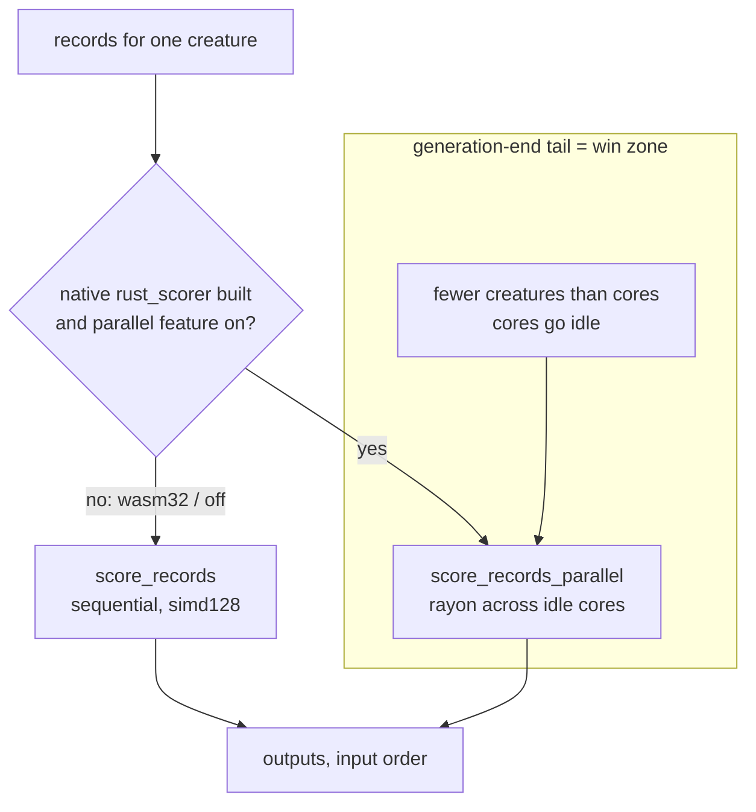

## Summary

Benchmarked the native `--features parallel` (rayon, #179) scoring lane against
the wasm32 single-thread lane on the production topology, and recorded the
native-vs-wasm32 decision in `neat-core/benches/BASELINE.md`. **The native lane
wins decisively**, so this is a **positive result**: production per-creature
scoring should route to `CompiledNetwork::score_records_parallel` wherever the
native `rust_scorer` is built. Closes #288.

The core-side deliverable the issue owns — a clean native scoring entry point
with a wasm32 fallback (`score_records_parallel`, sequential/wasm32 fallback via
`cfg`) — already exists from #179 and is guarded by the parity suite; this issue
proves it pays off at production scale and records the numbers. Cross-repo
production wiring is out of scope here and tracked in NEAT-AI #3399 (WorkerPool
idle-tail) and GRQ #3400 (flags), per the issue's one-root-cause-one-repo rule.

This is a benchmark + decision change (no Rust behaviour changed), so it follows
the Performance Task Workflow: before (wasm32) / after (native) numbers are
included and show a measurable win.

## Evidence

Measured 2026-07-18, Apple M4 Pro (8P + 4E, 12 logical cores), rustc 1.97.0,
`--release`, 4096 records (one production shard) through one creature.

- **Native**: `cargo bench -p neat-core --features parallel --bench parallel_scoring`
  (Criterion, `--sample-size 30`), median estimate.
- **wasm32**: `wasm-pack build --target nodejs --release` of a throwaway harness
  reusing the committed `benches/common` fixtures and calling the identical
  `score_records` (simd128 + relaxed-simd, `wasm-opt`), timed under Node (median
  of 20). Harness source + commands are committed in BASELINE.md → Reproducing.

| Shape | wasm32 1-thread | native 1 core | native 12 cores |
| --- | --- | --- | --- |
| `production` | 125.4 ms · 32.7 K rec/s | 45.96 ms · 89.1 K rec/s | 15.47 ms · 264.8 K rec/s |
| `production_2x` | 207.8 ms · 19.7 K rec/s | 102.7 ms · 39.9 K rec/s | 32.52 ms · 126.0 K rec/s |
| `production_exact` | 83.40 ms · 49.1 K rec/s | 46.77 ms · 87.6 K rec/s | 17.56 ms · 233.3 K rec/s |

On the exact committed topology (`production_exact`, 1,666 neurons / 21,513
synapses / 2,461 inputs):

- native **1.78×** wasm32 per core (NEON + FMA vs simd128 + relaxed-madd — pure codegen)
- native **4.75×** wasm32 at 12 cores (the production reality: one native creature
  uses idle cores a single-threaded wasm32 creature cannot)

Per-creature ~2.24 M-record corpus pass (the score-per-hour metric's
denominator): wasm32 ≈ 45.6 s → native single core ≈ 25.6 s → native 12 cores
≈ 9.6 s.

Native wins on two stacked axes: a per-core codegen advantage that applies to
every creature, and an idle-core advantage that pays off in the generation-end
tail (the **per-creature parallelism win zone**), where a single remaining
creature spreads its record batch across cores the wasm32 lane leaves idle. Full
numbers, win-zone characterisation, and honesty caveats (12-core variance,
squash-homogeneous fixture, wasm32 codegen ceiling) are in
`neat-core/benches/BASELINE.md`.

## Test Plan

No Rust behaviour changed; the native path and its wasm32 fallback are already
guarded by the existing parity suite, re-run green with `--features parallel`:

- `neat-core/tests/parallel_scoring.rs` — all 9 tests pass, including
  `parallel_scoring_matches_sequential_on_production_fixture` and
  `sequential_and_parallel_are_bit_identical` (the issue's correctness gate).
- `cargo bench -p neat-core --features parallel --bench parallel_scoring --no-run`
  — bench compile smoke test (the only automated bench gate).
- Docs validated with `markdownlint-cli2` (0 errors) and `codespell` (clean).
- `./quality.sh` run clean (fmt/clippy/deny/tests/doc/release).
