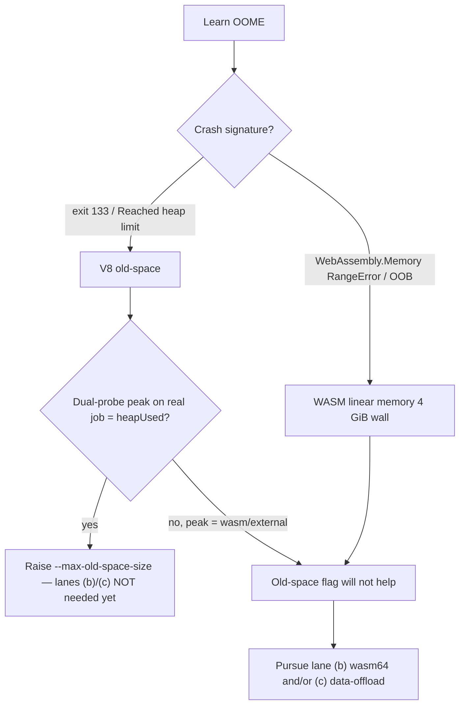

# wasm64 lane (a): diagnose whether the ~4 GB ceiling is the V8 heap or WASM linear memory

## Summary

Gating diagnostic for milestone #295. Establishes **where the ~4 GB learn-job
ceiling actually binds** — the V8 JS heap (old-space) or WASM linear memory —
before committing to a wasm64 build (lane b, #297) or a data-offload
architecture (lane c, #298). Delivers a runnable, dual-probe reproducer plus a
written finding backed by captured crash signatures and peak-memory numbers.
`Closes #296`.

**Finding (evidence-based):** the currently observed production ceiling is the
**V8 JS heap**. The downstream production trainer's captured OOME signature is
exit 133 / `Reached heap limit`
— the V8 old-space abort, reproduced here byte-for-byte — **not** a
`WebAssembly.Memory` RangeError or out-of-bounds trap. Raising
`--v8-flags=--max-old-space-size` demonstrably lets a previously-OOMing
old-space job complete. On this evidence lanes (b)/(c) are **not needed yet**,
but are **not closed**: they proceed if the dual-probe on the real Learn.ts job
attributes the peak to WASM linear memory, or if raising old-space merely walks
the job toward the hard **wasm32 4 GiB wall** (65536 pages × 64 KiB, verified
RAM-independent). The production re-run (acceptance step 3) needs an 8 GB
production host and is owned by lane (d) (#299); the finding hands it off explicitly rather
than shipping an unverified "heap cap suffices" conclusion.

Full write-up:
[`docs/research/wasm64-lane-a-4gb-ceiling-attribution.md`](../../research/wasm64-lane-a-4gb-ceiling-attribution.md).

### Captured evidence (Deno 2.9.0 / V8 14.9, 24 GB host)

| Ceiling | Signature captured | `--max-old-space-size` lifts it? |
| --- | --- | --- |
| V8 old-space | `Fatal JavaScript out of memory: Reached heap limit`, **exit 133** (= the production OOME) | **Yes** — 2000 MiB job OOMs at cap 256, completes at cap 3072 |
| WASM linear memory (wasm32) | `RangeError: WebAssembly.Memory.grow(): Maximum memory size exceeded` at **3.938 GiB → 4 GiB hard cap** | **No** — architectural, RAM-independent |

### Silent-failure guard (the fail-loud rule, Issue #3234)

A V8 old-space OOM is a **native abort** — the crashing child cannot print its
own `[learn] FAIL:` marker, and node.sh downgrades marker-less non-zero exits to
success. The harness's `markerForExit()` / `guard` mode subprocess the learn
child and synthesise the marker on exit 133, the launcher-side rule lane (d)
must adopt.

## Evidence

Backend/CLI diagnostic — no web interface to screenshot. Evidence is the
captured signatures above (reproduced in the finding doc) and the passing tests
below.

## Test Plan

- Added `tests/perf/learn_oome_repro.ts` — runnable diagnostic (modes
  `heap` / `wasm` / `guard` / `probe`), gated behind `LEARN_OOME_REPRO=1` so it
  never runs in default CI (8 GB+ host only). Captures **both** probes
  (`Deno.memoryUsage()` and `WebAssembly.Memory.buffer.byteLength`) and emits
  `[learn] FAIL:` markers.
- Added `tests/perf/learn_oome_repro_test.ts` — 13 "what" tests on the real
  classifier / probe / attribution / marker functions:
  - `classifyCrashSignature` maps exit-133 text → `v8-heap` and the
    `WebAssembly.Memory` RangeError → `wasm-linear-memory`.
  - `attributePeak` picks the dominant pool from a dual-probe snapshot.
  - `snapshotProbes` reports both probes together (never one silently).
  - `growWasmToCeiling` hits the hard 4 GiB cap when asked for more.
  - `markerForExit` synthesises the `[learn] FAIL:` marker for a marker-less
    exit 133 and stays silent on clean/already-flagged exits.
  - Run: `deno test --allow-env tests/perf/learn_oome_repro_test.ts` → 13 passed.
- No Rust touched — the cargo quality gates (`build`/`clippy`/`test`/`doc`) are
  unaffected; repo-wide `codespell` and `markdownlint-cli2` pass clean on the
  new files.
