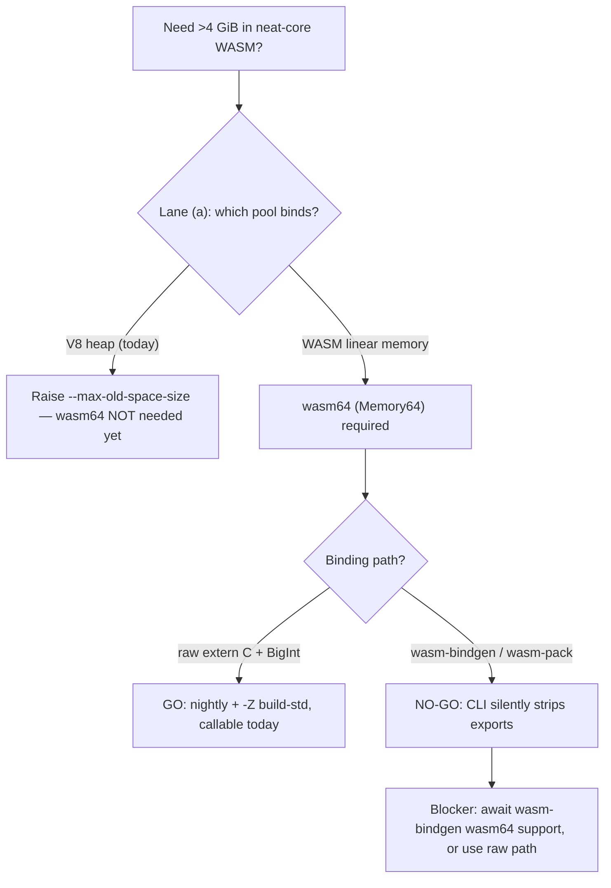

# wasm64 lane (b): build-lane feasibility spike (Rust Tier 3 + Deno/V8 Memory64)

## Summary

Time-boxed feasibility spike for milestone #295 (lane b). Establishes — with
exact toolchain versions, flags, and reproduction steps — **whether a working
wasm64 (Memory64) neat-core artefact is buildable and loadable in Deno 2.9.3
today**. Delivers a committed, runnable Memory64 smoke test wired into CI, plus a
written go/no-go finding backed by captured evidence. `Closes #297`.

**Finding — qualified GO:**

- **Runtime — GO.** Deno 2.9.3 / V8 14.9.207.2 instantiates a minimal
  `(memory i64 …)` module and grows linear memory past the wasm32 4 GiB ceiling,
  up to the V8 implementation limit of **262144 pages = 16 GiB**. `Memory.grow()`
  on an i64 memory requires and returns a `BigInt` (the observable 64-bit index
  signature). Growth reserves address space lazily, so the probe touches only a
  few pages (~34 MiB RSS) — cheap enough to run in default CI.
- **Build (raw) — GO, nightly only.** A trivial neat-core-style kernel builds for
  `wasm64-unknown-unknown` with `nightly-2026-07-19` + `rust-src` +
  `-Z build-std=std,panic_abort`, producing a genuine Memory64 module. **Stable
  is a no-go** (Tier 3, no prebuilt `std`; `rustup target add` refuses).
- **Bindings (raw) — GO.** The kernel is callable across the JS↔WASM boundary
  with 64-bit pointers passed as `BigInt`.
- **Build (production) — NO-GO.** `wasm-bindgen` / `wasm-pack` (the path this
  repo ships via `scripts/build-wasm-bundle.sh`) **silently strip** the exported
  bindings from a Memory64 module: the CLI exits 0 but the generated glue and
  `_bg.wasm` contain no `accumulate` / `__wbindgen_malloc`. The same crate emits
  working glue on wasm32. This is the hard blocker for any wasm-pack-based port.
- **Perf — no measurable regression.** A raw accumulate kernel over a 4 MiB
  (4 GiB-fitting) buffer runs within **±2 %** (measurement noise) wasm64 vs
  wasm32. A full #286 Criterion comparison is blocked by the wasm-bindgen no-go
  and is recorded as such rather than hidden.

**Recommendation (feeds #295 planning):** consistent with lane (a), do **not**
adopt wasm64 yet (today's ceiling is the V8 heap, liftable with
`--max-old-space-size`). If/when wasm64 is needed, the viable path is raw
`extern "C"` exports + hand-rolled `BigInt` bindings on nightly + `-Z build-std`
— **not** `wasm-pack`, until the toolchain ships working wasm64 post-processing.

Full write-up:
[`docs/research/wasm64-lane-b-build-lane-feasibility.md`](../../research/wasm64-lane-b-build-lane-feasibility.md).

## Evidence

Backend/runtime spike — no web interface to screenshot. Evidence is the captured
runtime signatures (in the finding doc), the committed smoke test, and the new
CI job that guards it.

Captured on Deno 2.9.3 / V8 14.9.207.2, rustc nightly `1.99.0 (9f36de775)`,
wasm-pack 0.13.1, wasm-bindgen 0.2.108:

| Axis | Result |
| --- | --- |
| Memory64 grow ceiling | 262144 pages = **16 GiB** (V8 impl limit) |
| `Memory.grow()` on i64 memory | requires + returns **`BigInt`**; `Number` throws `TypeError` |
| wasm64 raw build | **OK** (nightly + `-Z build-std`), module memory flag `0x04` = i64 |
| wasm-bindgen wasm32 vs wasm64 | wasm32 glue exports `accumulate`; **wasm64 strips it (exit 0)** |
| wasm64 vs wasm32 accumulate | within **±2 %** — no measurable regression |

## Test Plan

- Added `tests/wasm64_memory64_smoke_test.ts` (+ helpers
  `tests/wasm64_memory64_smoke.ts`) — 6 "what" tests that call real code and
  assert on observable outcomes:
  - a hand-assembled `(memory i64 …)` module validates and its memory section
    sets the i64 index flag (`0x04`);
  - `buildMemory64Module` rejects a max that cannot exceed the 4 GiB wall;
  - the module instantiates and grows linear memory **past 4 GiB**
    (`byteLength > 4 GiB`);
  - `grow()` requires and returns a `BigInt`; a `Number` delta throws;
  - a `BigInt` offset **above 4 GiB** round-trips through the module's exported
    `store`/`load` functions (two independent addresses, no 32-bit wrap-around);
  - `unsignedLeb128` encodes multi-byte page counts.
  - Run: `deno test tests/wasm64_memory64_smoke_test.ts` → 6 passed, ~9 ms,
    ~34 MiB RSS. Full `deno test tests/` → 19 passed (with lane a).
- Added a `wasm64-memory64-smoke` CI job (`.github/workflows/ci.yml`, Deno 2.9.3,
  `denoland/setup-deno` SHA-pinned) so a Deno/V8 upgrade dropping Memory64 fails
  in CI — the issue's earliest failure-detection point.
- No Rust changed. Confirmed unaffected: `cargo check` / `cargo clippy -D
  warnings` / `cargo test` all green; `actionlint` and the workflow-guard bats
  suite pass on the updated `ci.yml`; markdownlint + codespell clean on new docs.
