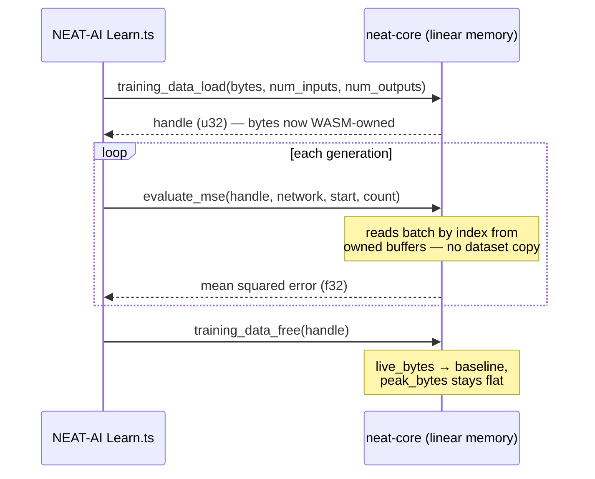

# wasm64 lane (c): offload training data into WASM linear memory

## Summary

Implements the neat-core half of milestone #295 lane (c): neat-core now **owns**
the training dataset inside its own WASM linear memory, so the large numeric
input/target arrays no longer sit on the V8 JS heap that lane (a) attributed the
~4 GB Learn ceiling to (exit-133 / "Reached heap limit" = GRQ#3508). JS holds a
small `u32` **handle**, not the bytes, and per-generation evaluation reads
batches **by index** from the WASM-owned buffers — the full dataset never
re-crosses the JS↔WASM boundary after the initial load. Closes #298.

New module `neat-core/src/wasm_dataset.rs`:

- **`TrainingDataset`** — de-interleaves the packed `.bin` record stream
  (`inputs … outputs` per record) into contiguous structure-of-arrays
  input/target buffers **once**, at load time. Batch reads (`input_batch`,
  `target_batch`, `record_inputs/outputs`) are then contiguous slices, and
  `evaluate_mse(network, start, count)` scores a batch reading straight from
  linear memory. `byte_len()` exposes the footprint.
- **`DatasetRegistry`** — the ownership seam agreed with NEAT-AI#3410: `load`
  returns a handle, `free` releases the dataset. It tracks `live_bytes` and
  `peak_bytes`, so a lifecycle leak (bytes retained past `free`) is observable —
  the high-water mark stays flat across load → evaluate → free cycles. Freed
  slots are reused so an equal-sized reload does not grow the peak.
- **WASM shims** (`training_data_load` / `_evaluate_mse` / `_free` /
  `_num_records` / `_byte_len` / `_live_bytes` / `_peak_bytes`) in
  `wasm_exports.rs`, gated to `wasm32`. Byte counts and record indices cross as
  `u64` (JS `BigInt`) so the surface is **Memory64-ready** for the >4 GB jobs the
  milestone targets (lane (b) confirmed V8 grows past the 4 GiB wasm32 wall).

Fail-loud throughout (Issue #3234): a ragged buffer, an out-of-range batch, an
unknown/double-freed handle, or a network/dataset shape mismatch each surface a
typed `DatasetError` rather than a silent wrong result.

### Coordination / scope

- **NEAT-AI#3410 (Learn heap / MemoryMonitor):** this PR delivers only the
  neat-core memory + bindings seam (the handle table and by-index evaluation).
  The `Learn.ts` wiring and the MemoryMonitor fix remain owned by NEAT-AI#3410 —
  not duplicated here. The consuming repo bumps to a released neat-core through
  the ordinary dependency-bump flow once this lands.
- **Perf gate (#286 Criterion baseline):** the existing hot paths
  (`activate` / `score_batch_into`) are unchanged, so the `hot_paths` /
  `parallel_scoring` benches are unaffected — no throughput regression on
  jobs that already fit. The offload adds a new load-time de-interleave, off the
  per-generation scoring hot path.

## Evidence

Backend/library change — no web interface to screenshot. Verified by the new
`wasm_dataset_offload` test suite plus the crate unit tests; the whole
`./quality.sh` gate passes (fmt, clippy `-D warnings` on native **and**
`wasm32-unknown-unknown`, tests, doc, cargo-deny, bats). `cargo check
--target wasm32-unknown-unknown` confirms the `#[wasm_bindgen]` shims compile.

Key acceptance criteria mapped to tests:

- *Dataset owned in WASM, JS holds a handle* →
  `registry_hands_out_handles_not_bytes`, `registry_free_releases_bytes_and_reuses_slot`.
- *Evaluation reads batches by index without re-marshalling the dataset* →
  `evaluation_reads_the_batch_by_index_from_owned_memory`,
  `evaluation_does_not_reload_or_mutate_the_dataset` (footprint + record count
  unchanged across 50 generations; only handle + network + bounds per call).
- *Load → evaluate N generations → free → high-water mark stable* (leak gate) →
  `load_evaluate_free_lifecycle_keeps_high_water_mark_stable` (8 cycles ×
  5 generations; `live_bytes` returns to 0 after each free, `peak_bytes` flat).
- *Fail loud* → `from_packed_bytes_rejects_unaligned_buffer`,
  `batch_out_of_range_fails_loud`, `registry_double_free_fails_loud`,
  `evaluation_rejects_network_dataset_shape_mismatch`,
  `evaluation_rejects_out_of_range_batch`.

## Test Plan

- `neat-core/tests/wasm_dataset_offload.rs` — 6 integration "what" tests
  (evaluation-by-index correctness, no-reload invariant, shape/range fail-loud,
  the load/evaluate/free leak high-water-mark gate, handle-not-bytes ownership).
- `neat-core/src/wasm_dataset.rs` unit tests — 10 tests (SoA de-interleave,
  unaligned/zero-arity rejection, contiguous batch slices, `byte_len`,
  `from_soa` mismatch, registry free/reuse, unknown-handle and double-free
  fail-loud).
- `cargo test --workspace --lib --tests --all-features` green; `cargo check
  --target wasm32-unknown-unknown` and `cargo clippy` (native + wasm32) clean.
