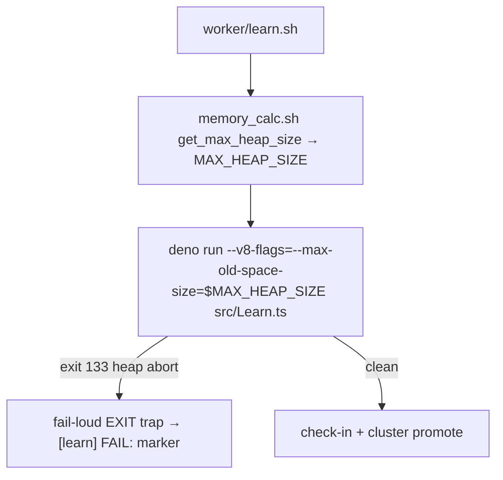

# wasm64 lane (d): downstream learn-invocation wiring + 8 GB-host verification

## Summary

Milestone #295 lane (d): verify — end-to-end, from neat-core — that the
downstream production trainer's learn invocation adopts the chosen headroom
mitigation correctly, and record the 8 GB host outcome for the production OOME.
**Closes #299.**

Lane (a) (#296) attributed that learn OOME to the **V8 old-space heap**
(exit 133 / "Reached heap limit"), liftable by
`--v8-flags=--max-old-space-size=<N>`. This lane confirms the production
trainer's `worker/learn.sh` selects that flag **RAM-aware** and fails **loud** on
a heap abort, and pins those invariants with a neat-core acceptance model that is
**lock-step** with the production selector.

Verified against the downstream production trainer's `Develop` branch (no change
was required there — the wiring already ships):

1. **RAM-aware heap flag** — `worker/learn.sh` injects
   `--v8-flags=--max-old-space-size=${MAX_HEAP_SIZE}`, sized by
   `worker/shared/memory_calc.sh` (`get_max_heap_size`): `clamp((available −
   1536) × 65%, floor(total) .. 24576)` MB.
2. **Constrained-host guard (#3342)** — the 8 GB-tier floor steps *down* on a
   low-available host (≤45% of available, never below 1536 MB), so it can never
   over-commit a constrained 8 GB host (the constrained-host crash class).
3. **Silent-failure guard (the fail-loud rule, Issue #3234)** — learn.sh's
   fail-loud EXIT trap emits a `[learn] FAIL:` marker on a
   native exit-133 abort, so node.sh cannot downgrade it to success.

The neat-core acceptance model `tests/perf/learn_flags_wiring.ts` re-derives the
selection and was **cross-checked against the production trainer's real
`memory_calc.sh`** — the MB
values match exactly (4 GB → 1664, 8 GB → 4326, constrained-8 GB → 1739, 16 GB →
9651, 64 GB → 24576, 2 GB → 1536).

### 8 GB-host status (honest)

- **The production OOME issue is closed `COMPLETED`** — the downstream-side
  containment is shipped; the fleet owns the live 8 GB job re-run. Recorded, not
  simulated: a live fleet-host run needs the full production cluster environment
  and is fleet/human-owned.
- The **residual heap growth** (why an 8 GB host cannot simply be handed a bigger
  heap) is fixed by lane (c)'s `wasm_dataset` offload, whose `Learn.ts` adoption
  is upstream in **NEAT-AI#3410** and reaches the production trainer via the ordinary
  released-dependency bump (#1613/#2944) once released — not via a raw
  commit/pre-release.

## Evidence

Backend/CLI verification — no web interface to screenshot. Evidence is the
lock-step cross-check and the passing tests.

| Host (total / available) | model | real `memory_calc.sh` | heap + 1536 ≤ total |
| --- | --- | --- | --- |
| 4 GB / 4096 | 1664 | 1664 | ✓ |
| 8 GB / 8192 | 4326 | 4326 | ✓ |
| 8 GB / 3865 (constrained) | 1739 | 1739 | ✓ |
| 16 GB / 16384 | 9651 | 9651 | ✓ |
| 64 GB / 65536 | 24576 | 24576 | ✓ |

Full finding:
[`docs/research/wasm64-lane-d-learn-wiring-verification.md`](../../research/wasm64-lane-d-learn-wiring-verification.md).

## Test Plan

- Added `tests/perf/learn_flags_wiring.ts` (acceptance model) +
  `tests/perf/learn_flags_wiring_test.ts` — **13 "what" tests**, all passing
  (`deno test tests/perf/learn_flags_wiring_test.ts`). They assert:
  - RAM-aware selection for 2/4/8/16/64 GB (incl. the constrained-8 GB #3342
    step-down) — lock-step with the production selector's own `MemoryCalcHeapSize.ts`.
  - Budget-fit: heap + FFI/OS headroom ≤ total RAM on every supported tier.
  - Monotonic in RAM; safe fall-back below the 8 GB tier (4 GB keeps the 1536 MB
    floor, not the 8 GB tier's 3072 MB).
  - The composed `--v8-flags=--max-old-space-size` token.
  - The silent-failure `[learn] FAIL:` marker on a marker-less exit-133.
- No Rust touched — `cargo check --workspace --all-targets --all-features` is
  green; shellcheck, codespell, markdownlint, `deno fmt/lint/check` all pass.
- The production selector's authoritative CI gate remains its own
  `MemoryCalcHeapSize.ts` / `MemoryCalcHostFloor.ts`.
