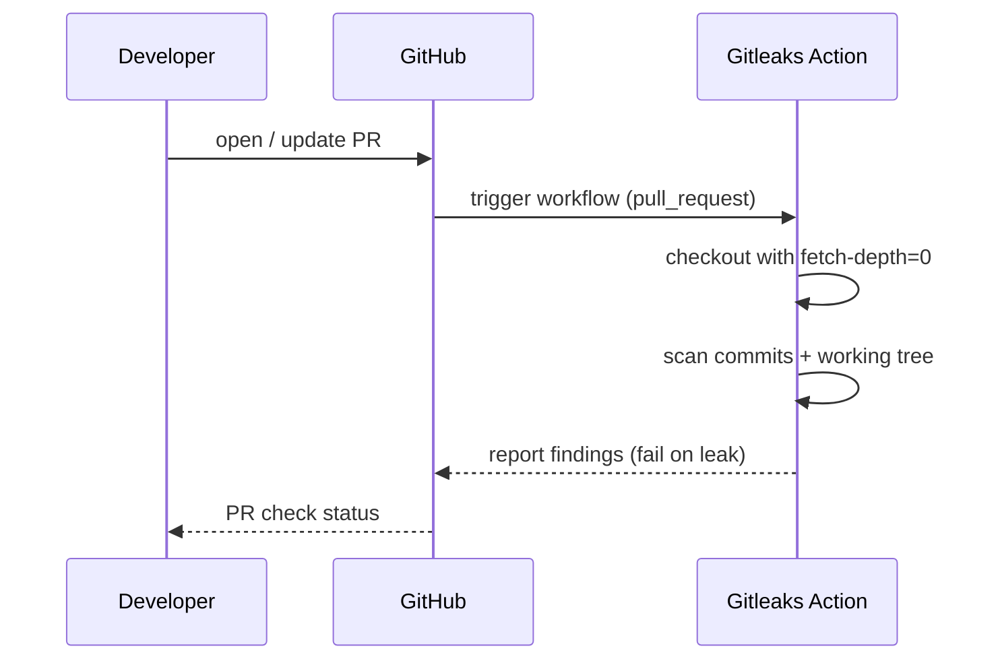

## Summary

Added `.github/workflows/gitleaks.yml` to run [Gitleaks](https://github.com/gitleaks/gitleaks) secrets detection on every pull request. The workflow uses `gitleaks/gitleaks-action@v2`, performs a full-history checkout (`fetch-depth: 0`) so historical commits are scanned, and runs with the least-privilege `contents: read` permission. The repository's existing `.gitleaks.toml` allowlist is picked up automatically by the action.

Closes #3.

## Evidence

This is a CI/workflow change with no UI or runtime code paths to screenshot. Validation performed:

- `./quality.sh` passes cleanly (fmt, clippy, deny, tests, doc, release build).
- The workflow YAML uses the exact template from the issue, with the addition of the `GITLEAKS_LICENSE` env var (organisation licence key, sourced from repo/org secrets) so the action is ready for org-licensed runs; it is harmless when unset for public repos.

## Test Plan

- [x] `./quality.sh < /dev/null` — passes.
- [x] Workflow file is valid YAML and matches the template specified in issue #3.
- [ ] First PR raised after merge will exercise the new workflow on real CI.
