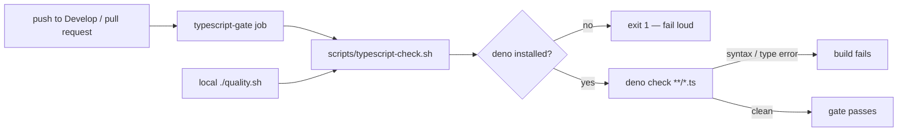

# TypeScript CI validity gate (Issue #307)

## Summary

CI had no basic-validity gate for the committed TypeScript sources: only
`tests/wasm64_memory64_smoke_test.ts` was ever executed (by the
`wasm64-memory64-smoke` job), so a syntax or type error in any of the other five
`.ts` helpers under `tests/` could land on `Develop` unnoticed.

This adds a repo-owned gate — `scripts/typescript-check.sh` — that type-checks
every `.ts` file in the tree with `deno check`, and wires it into both the local
`./quality.sh` run and a new CI job. Basic validity only; this is not a style or
lint gate. Following the repository-isolation rule, the gate is committed to and
enforced by this repository — no shared cross-repo Action is introduced.

Closes #307.

## What changed

- **`scripts/typescript-check.sh`** (new) — discovers all `.ts` files under a
  root directory (default: repo root), excluding `target/`, `.git/` and
  `node_modules/`, and runs `deno check` over them. Fails loud when `deno` is
  absent (exit 1 with install guidance) rather than skipping the check and
  reporting green.
- **`.github/workflows/ci.yml`** — new `typescript-gate` job. Like `rust-gates`,
  it carries no PR-only guard, so it runs on direct pushes to `Develop` as well
  as on every pull request. Deno is pinned to `2.9.3` via the already
  SHA-pinned `denoland/setup-deno` action.
- **`quality.sh`** — invokes the same script, so the local gate mirrors CI.
- **`README.md`** — documents the gate under **Build**.



## Evidence

Backend/CLI change — no web interface to screenshot.

The gate demonstrably rejects a broken file. A temporary `tests/perf/_gate_demo.ts`
containing `export function broken(: number {` produced:

```text
typescript-check: checking 7 TypeScript file(s) with deno check
error: SyntaxError: Unexpected token `:`. Expected yield, an identifier, [ or {
  |
1 | export function broken(: number {
  |                        ~
EXIT=1
```

With that file removed, the repository's six real TypeScript sources pass:

```text
typescript-check: checking 6 TypeScript file(s) with deno check
typescript-check: all TypeScript files passed basic validity
```

`./quality.sh < /dev/null` passes end to end (196 → 204 bats tests, full
`cargo` gate green), and `actionlint .github/workflows/ci.yml` is clean.

## Test Plan

New "what" tests in `tests/scripts/typescript_check.bats` — each builds a real
throwaway tree and asserts on the gate's exit status:

- `a valid TypeScript file passes the gate`
- `a syntax error fails the gate` (regression test for the missing gate)
- `a type error fails the gate`
- `a tree with no TypeScript files passes and says so`
- `build artefacts under target/ are not checked`
- `a missing deno fails loud rather than skipping the check`
- `a non-existent root directory is rejected`
- `the repository's own TypeScript sources pass the gate`

## Security self-check

- Input validation: the sole argument is validated as an existing directory
  before use; file paths are passed to `deno check` as an argv array, never
  interpolated into a shell string.
- No secrets or hidden files staged; the workflow YAML is the only `.github/`
  path touched.
- No new dependencies; Deno is pinned to `2.9.3` via the existing SHA-pinned
  `denoland/setup-deno` action.
- Failures surface as non-zero exits with context — no swallowed errors, no
  silent fallback.
