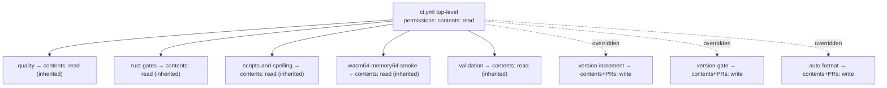

# PR Summary — Issue #309

## Summary

The `quality` job in `.github/workflows/ci.yml` (and its read-only siblings)
inherited the repository's broad default `GITHUB_TOKEN` scopes because `ci.yml`
declared no workflow-level `permissions:` block — every other workflow in the
repo already sets a top-level default, making `ci.yml` the outlier.

Added a least-privilege top-level `permissions: contents: read` default to
`ci.yml`. Read-only jobs (`quality`, `rust-gates`, `scripts-and-spelling`,
`wasm64-memory64-smoke`, `validation`) now inherit this narrow scope; the jobs
that must push to PR branches (`version-increment`, `version-gate`,
`auto-format`) keep their broader job-level `permissions` overrides, so their
behaviour is unchanged.

This closes the least-privilege gap for the `quality` job with a single
workflow-level change, consistent with the pattern used by every other workflow
in this repository. Closes #309.

## Evidence

Backend/CI-only change — no web interface to screenshot.

Effective token scope per job after the change:

Verification (`bats tests/scripts/`): all 190 tests pass, including the two new
assertions. `actionlint .github/workflows/ci.yml` is clean and the YAML parses.

## Test Plan

Added `tests/scripts/workflow_least_privilege_permissions.bats` (TDD — both
tests failed before the fix, pass after):

- `every job in every workflow has an explicit permissions block` — parses each
  workflow's YAML and asserts every job has effective permissions (workflow-level
  default or job-level override). This is the regression guard: before the fix
  the `quality` job failed it.
- `ci.yml quality job runs under contents: read (no write scopes)` — resolves
  the `quality` job's effective permissions and asserts `contents: read` with no
  `write` scopes granted.
