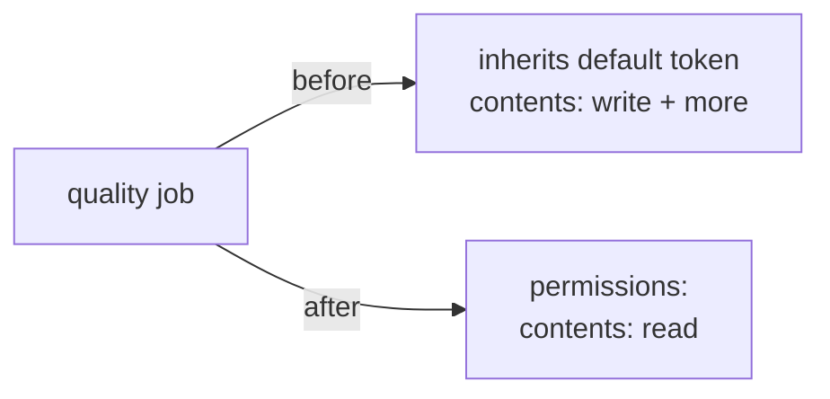

# Add least-privilege `permissions:` block to CI `quality` job

## Summary

The `quality` job in `.github/workflows/ci.yml` declared no `permissions:`
block at either workflow or job level, so it silently inherited the
repository's broad default `GITHUB_TOKEN` scopes (often `contents: write` and
more). If any step were compromised, the token could act with those broad
scopes. The `quality` job is read-only — it checks out the repo, runs
`git pull`, and executes `cargo deny / fmt / clippy / test / doc`; it never
pushes. It now declares an explicit least-privilege grant:

```yaml
permissions:
  contents: read
```

Closes #309.

## Change



Scope was kept to the `quality` job named in the issue — other jobs already
declare their own `permissions:` blocks where they need elevated scopes
(`version-increment`, `auto-format`, `version-gate`).

## Evidence

Backend/CI-config change only — no web interface to screenshot. Verified via
new bats tests plus the existing actionlint gate, which validates the workflow
on disk:

```
1..3
ok 1 ci workflow file exists
ok 2 quality job declares an explicit permissions block
ok 3 quality job grants contents: read (least privilege, no write)
```

`tests/scripts/rust_gates_workflow.bats`, `actionlint_workflow.bats`,
`workflow_sha_pinning.bats` and `workflow_script_injection.bats` all continue to
pass (23/23), confirming the workflow remains valid, SHA-pinned, and
injection-safe.

## Test Plan

- Added `tests/scripts/ci_quality_permissions.bats`:
  - `quality job declares an explicit permissions block` — fails against the
    unfixed workflow (reproduces #309), passes after the fix.
  - `quality job grants contents: read (least privilege, no write)` — asserts
    `contents: read` and that the job holds no `write` scope.
- Re-ran the workflow-related bats suites to confirm no regression.
