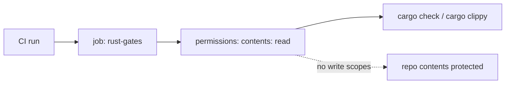

## Summary

The `rust-gates` job in `.github/workflows/ci.yml` declared no `permissions:` block at
either job or workflow level, so it inherited the repository's broad default
`GITHUB_TOKEN` scopes. The job only checks out the repo and runs `cargo check` /
`cargo clippy`, so it now declares the least-privilege grant `contents: read`.
Closes #310.

## Evidence

Backend/CI-only change — no web interface to screenshot. Verified by a new bats
suite that parses the committed workflow YAML and asserts the observable CI
contract (job holds an explicit `permissions:` block, `contents: read`, and no
write scopes). The suite failed before the workflow edit and passes after:

```text
1..3
ok 1 ci workflow file exists
ok 2 rust-gates job declares an explicit permissions block
ok 3 rust-gates job grants contents: read (least privilege, no write)
```

`./quality.sh` passes cleanly.



## Test Plan

- Added `tests/scripts/ci_rust_gates_permissions.bats` (3 tests) — mirrors the
  Issue #309 `quality`-job suite; regression test that fails against the
  unfixed workflow and passes after the fix.
- Existing `bats tests/scripts` and full `./quality.sh` gate re-run green.
