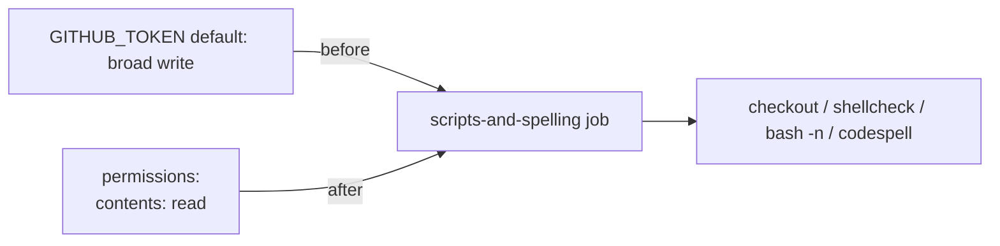

## Summary

Added an explicit least-privilege `permissions:` block to the `scripts-and-spelling`
job in `.github/workflows/ci.yml`. The job previously declared no `permissions:`
block at either workflow or job level, so it silently inherited the repository's
broad default `GITHUB_TOKEN` scopes. This job only reads the repo (checkout,
shellcheck, `bash -n`, codespell) and never pushes, so `contents: read` is the
correct least-privilege grant. Closes #311.

This mirrors the fix applied to the sibling `quality` job in Issue #309.



## Evidence

Backend/CI-config change only — no web interface to screenshot. Verified via a
new BATS test that parses `.github/workflows/ci.yml` with `python3`/`yaml` and
asserts the job-level (or workflow-level) `permissions:` block grants
`contents: read` with no `write` scopes.

Test run (after the fix):

```
1..3
ok 1 ci workflow file exists
ok 2 scripts-and-spelling job declares an explicit permissions block
ok 3 scripts-and-spelling job grants contents: read (least privilege, no write)
```

`./quality.sh` passes cleanly: `✅ All quality checks passed!`

## Test Plan

- Added `tests/scripts/ci_scripts_and_spelling_permissions.bats`:
  - `ci workflow file exists`
  - `scripts-and-spelling job declares an explicit permissions block` — fails
    against the unfixed workflow, passes after.
  - `scripts-and-spelling job grants contents: read (least privilege, no write)`
    — asserts `contents: read` and that no scope is granted `write`.
- Confirmed the test failed before the workflow change and passes after (TDD).
