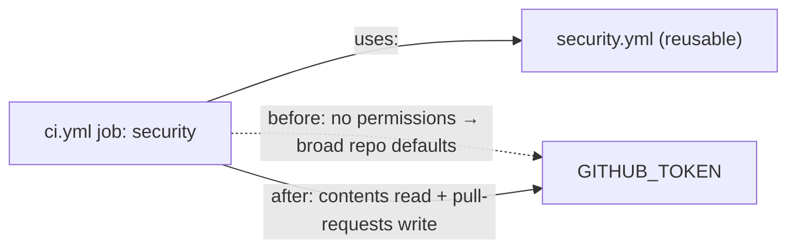

## Summary

The `security` job in `.github/workflows/ci.yml` calls the reusable workflow
`.github/workflows/security.yml` but declared no `permissions:` block, so it
handed the called workflow the repository's broad default `GITHUB_TOKEN`
scopes. It now declares the least-privilege set the called workflow actually
needs — `contents: read` (checkout, `cargo audit`) plus `pull-requests: write`
(the `dependency-review` PR comment summary). Closes #312.



## Evidence

Backend/CI-configuration change — no web interface to screenshot. Verified via
the new BATS suite (failing before the workflow edit, passing after) and a full
`./quality.sh` run, which completed with `✅ All quality checks passed!`.

Before the fix:

```
not ok 2 security job declares an explicit permissions block
not ok 3 security job grants only the scopes the reusable workflow needs
not ok 4 caller scopes cover every scope the called workflow declares
```

After the fix: all 4 tests pass.

## Test Plan

- Added `tests/scripts/ci_security_permissions.bats`:
  - `security job declares an explicit permissions block` — regression test for
    the reported finding.
  - `security job grants only the scopes the reusable workflow needs` —
    `contents: read`, with `pull-requests` the only write scope.
  - `caller scopes cover every scope the called workflow declares` — the caller
    grant is not weaker than anything `security.yml` requires, so the reusable
    workflow keeps working.
- Existing suites unchanged; `./quality.sh` passes.
