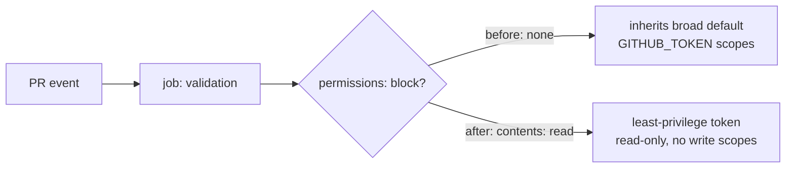

# PR Summary — Issue #313

## Summary

The `validation` job in `.github/workflows/ci.yml` declared no `permissions:`
block, at either job or workflow level, so it inherited the repository's broad
default `GITHUB_TOKEN` scopes. The job is read-only — checkout, `cargo
metadata`, and manifest/README/rustdoc file checks — so it now declares the
least-privilege scope it actually needs:

```yaml
permissions:
  contents: read
```

This follows the same per-job pattern already applied to `quality` (#310),
`scripts-and-spelling` (#311), `rust-gates`, and `security` (#312).
Closes #313.

## Evidence

Backend/CI-config change only — no web interface to screenshot. Verified by the
new bats suite, which parses the committed workflow YAML and asserts on the
observable CI contract:

```
$ bats tests/scripts/ci_validation_permissions.bats
1..3
ok 1 ci workflow file exists
ok 2 validation job declares an explicit permissions block
ok 3 validation job grants read-only contents and no write scopes
```

All three permission assertions failed before the workflow change and pass
after it. Full `./quality.sh` run passes cleanly.



## Test Plan

- Added `tests/scripts/ci_validation_permissions.bats`:
  - `ci workflow file exists`
  - `validation job declares an explicit permissions block` — regression test
    for #313; fails against the unfixed workflow.
  - `validation job grants read-only contents and no write scopes` — asserts
    `contents: read` and that no scope is granted `write`.
- Ran `./quality.sh < /dev/null` — all checks pass (bats, shellcheck,
  `cargo test --workspace`, clippy, docs, release build).
