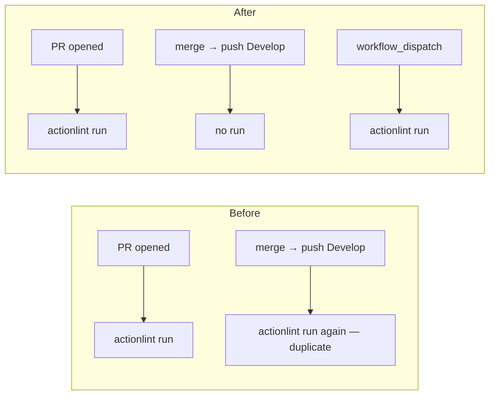

## Summary

`.github/workflows/actionlint.yml` triggered on both `pull_request` and `push` to
`Develop`. As a lint/check gate it already runs on the PR, so the post-merge push
run was a duplicate — burning CI minutes and able to leave a red tick on the
default branch for a check that already passed. Dropped the `push:` trigger,
keeping `pull_request` and adding `workflow_dispatch` for manual re-runs. This
matches the existing PR-only checkers `gitleaks.yml` and `semgrep.yml`.
Deploy/publish workflows (`release.yml`, `wasm-bundle.yml`) and the main `ci.yml`
build are untouched — they must keep firing on push. Closes #314.

## Evidence

Backend/CI-config change — no web interface to screenshot. Verified via the
existing BATS suite (`bats tests/scripts/actionlint_workflow.bats`, 7/7 passing,
including the local `actionlint` sanity run over every workflow on disk) and a
clean `./quality.sh`.

## Test Plan

- Modified `tests/scripts/actionlint_workflow.bats::"actionlint workflow gates PRs
  only and does not re-run on push to Develop"` (previously *"...triggers on PRs
  and on pushes to Develop"*). **Documented business-logic change:** the old
  assertion required `Develop` in the `push.branches` list, which is exactly the
  behaviour this issue removes; the test now asserts `pull_request` is still a
  trigger and that `Develop` is absent from any `push.branches` filter. It failed
  against the unfixed workflow and passes after the change. No tests were removed
  or commented out.
- All 7 tests in `tests/scripts/actionlint_workflow.bats` pass.
- `./quality.sh` passes cleanly (fmt, clippy, deny, workspace tests, doc, release
  build).
