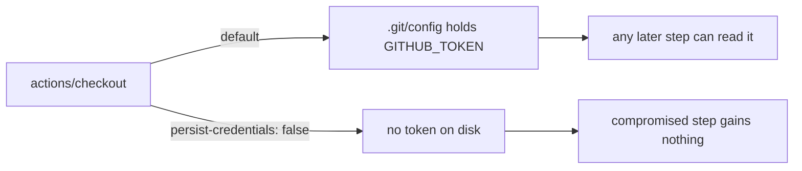

## Summary

The `actionlint` job checked out the repo with `actions/checkout` defaults, which writes the workflow `GITHUB_TOKEN` into `.git/config` as an auth header. Every later step in the job — including a compromised dependency or injected script — could read it and act as the token. The job only lints workflow files: it never pushes back and fetches no private submodule, so the persisted credential was pure blast radius.

Added `persist-credentials: false` to the checkout step in `.github/workflows/actionlint.yml`. Closes #317.

## Evidence

CI/workflow change — no web interface to screenshot. Verified via the repo's bats workflow tests and `./quality.sh`.

Failing before the fix, passing after:

```
not ok 7 actionlint workflow checkout does not persist credentials on disk   # before
ok 7 actionlint workflow checkout does not persist credentials on disk       # after
```

Full suite after the fix:

```
1..8
ok 1 actionlint workflow file exists
ok 2 actionlint workflow is valid YAML
ok 3 actionlint workflow gates PRs only and does not re-run on push to Develop
ok 4 actionlint workflow exposes a job that runs the actionlint binary
ok 5 actionlint workflow pins third-party actions to commit SHAs
ok 6 actionlint workflow pins both version and SHA-256 for the CLI install
ok 7 actionlint workflow checkout does not persist credentials on disk
ok 8 actionlint passes against the current workflows on disk
```

`./quality.sh < /dev/null` → `✅ All quality checks passed!`



## Test Plan

- Added `tests/scripts/actionlint_workflow.bats::actionlint workflow checkout does not persist credentials on disk` — parses the workflow YAML and asserts every `actions/checkout` step in the `actionlint` job sets `with.persist-credentials: false`. Reproduces #317 (fails against the unfixed workflow, passes after).
- Existing tests in the same file unchanged and still passing.
