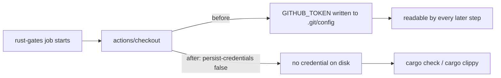

## Summary

The `rust-gates` job in `.github/workflows/ci.yml` checked out the repository
without `persist-credentials: false`, so `actions/checkout` wrote the workflow
`GITHUB_TOKEN` into `.git/config` as an auth header. Any later step in the job —
including a compromised dependency or injected script — could read it and act as
the token. The job only checks out, compiles (`cargo check`) and lints
(`cargo clippy`): it never pushes back to the repository and fetches no private
submodule, so the persisted credential was pure blast radius.

Added `persist-credentials: false` to that checkout step, matching the existing
treatment of the `actionlint` workflow (Issue #317). Closes #318.

## Evidence

Backend/CI-only change — no web interface to screenshot.

Verified with the repository's own gates:

- `bats tests/scripts/rust_gates_workflow.bats` — 8/8 pass (the new test fails
  against the unfixed workflow and passes after the change).
- `./quality.sh < /dev/null` — passes cleanly.

## Test Plan

- Added `tests/scripts/rust_gates_workflow.bats::"ci rust-gates checkout does
  not persist credentials on disk"` — parses `ci.yml`, locates every
  `actions/checkout` step in the `rust-gates` job and asserts
  `with.persist-credentials is False`. This is a regression test: it failed
  before the workflow change and passes after it.
- All pre-existing tests in that file remain unchanged and still pass.
