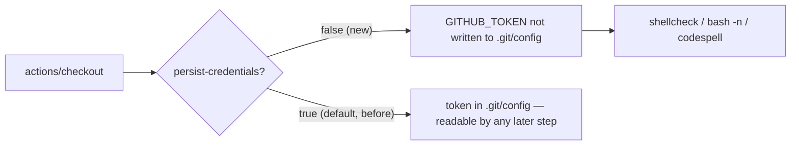

## Summary

Harden the `scripts-and-spelling` CI job so `actions/checkout` no longer
persists the workflow `GITHUB_TOKEN` into `.git/config`. Added
`persist-credentials: false` to the checkout step in `.github/workflows/ci.yml`.

The job only runs shellcheck, `bash -n` syntax checks and codespell — it never
pushes back to the repository and fetches no private submodule — so it does not
need the persisted credential. Dropping it narrows the blast radius of any
later compromised step in the job. Closes #319.

## Evidence

Backend/CI-only change — no web interface to screenshot.

- `.github/workflows/ci.yml`:381 now sets `persist-credentials: false` on the
  `scripts-and-spelling` checkout step.
- YAML validated: `python3 -c "import yaml; yaml.safe_load(open('.github/workflows/ci.yml'))"` → `YAML OK`.

## Test Plan

No unit test applies: this is a workflow-YAML security-hardening change with no
Rust or shell code path to exercise. Asserting the setting via a source grep
would be a "how" test (implementation-detail assertion), which `AGENTS.md`
explicitly discourages. Verification performed instead:

- Confirmed the setting sits under the correct `scripts-and-spelling` checkout
  step (single `persist-credentials` occurrence, line 381).
- Validated the workflow still parses as valid YAML.
