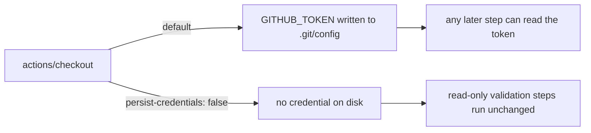

## Summary

The CI `validation` job checked out the repository without
`persist-credentials: false`, so `actions/checkout` wrote the workflow
`GITHUB_TOKEN` into `.git/config` as an auth header. Every later step in that
job — including a compromised dependency or an injected script — could read it
and act as the token.

The job is read-only (manifest, README and rustdoc checks): it never pushes back
and fetches no private submodule, so the persisted credential was pure blast
radius. Added `persist-credentials: false` to the job's checkout step, mirroring
the hardening already applied to `rust-gates` (Issue #318) and `actionlint`
(Issue #317).

Closes #320.

## Evidence

Backend/CI-configuration change — there is no web interface to screenshot.
Verified by a new bats gate that parses `.github/workflows/ci.yml` and asserts
the observable contract:

```
$ bats tests/scripts/validation_workflow.bats   # before the fix
ok 1 ci workflow defines a validation job
not ok 2 ci validation checkout does not persist credentials on disk

$ bats tests/scripts                            # after the fix
216 passing, 0 failing

$ ./quality.sh < /dev/null
✅ All quality checks passed!
```



## Test Plan

- Added `tests/scripts/validation_workflow.bats`:
  - `ci workflow defines a validation job` — guards the job name the second
    test targets, so a rename fails loudly rather than silently passing.
  - `ci validation checkout does not persist credentials on disk` — regression
    test that fails against the unfixed workflow and passes after the fix.
- Re-ran the full `bats tests/scripts` suite (216 tests) and `./quality.sh`.
