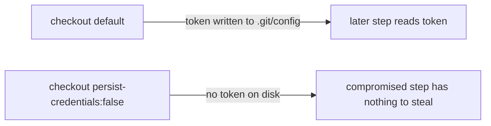

# Job `markdownlint` checkout persists credentials — harden `markdown-lint.yml`

## Summary

The `markdownlint` job in `.github/workflows/markdown-lint.yml` ran
`actions/checkout` without `persist-credentials: false`. By default checkout
writes the workflow `GITHUB_TOKEN` into `.git/config` as an auth header, where
any later step in the job could read it and act as the token. This job only
lints Markdown and validates Mermaid blocks — it never pushes back to the
repository and fetches no private submodule — so the persisted credential was
pure blast radius.

Added `persist-credentials: false` to the checkout step, matching the
established convention already applied to `actionlint.yml`, `gitleaks.yml`, and
`ci.yml` (Issues #317–#320). Closes #322.

## Evidence

Backend/CI-only change — no web interface to screenshot. Verified via the bats
workflow test suite:

- Added `markdown-lint workflow checkout does not persist credentials on disk`
  to `tests/scripts/markdown_lint_workflow.bats`, which parses the workflow YAML
  and asserts every `actions/checkout` step in the `markdownlint` job sets
  `persist-credentials: false`.
- Regression check: the new test **fails** against the unfixed workflow (`not ok
  6 ... checkout does not persist credentials`) and **passes** after the fix.
- Full `./quality.sh` run passes cleanly.

## Test Plan

- `tests/scripts/markdown_lint_workflow.bats` — new
  `markdown-lint workflow checkout does not persist credentials on disk` test
  (11/11 pass).
- `./quality.sh < /dev/null` — all quality checks pass.
