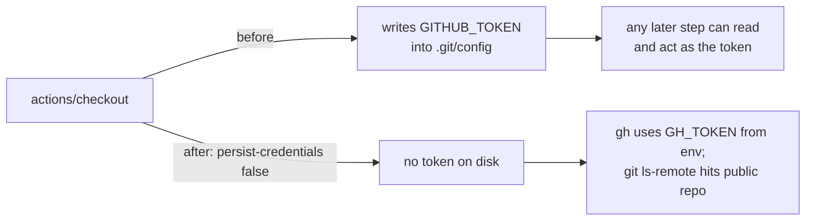

## Summary

The `release` job's `actions/checkout` step ran without `persist-credentials: false`, so `actions/checkout` wrote the workflow `GITHUB_TOKEN` into `.git/config` as an auth header — leaving a usable credential on disk for every later step in the job. This job cuts the semver tag and publishes the GitHub release via `gh` using `GH_TOKEN` from the environment, and its only git-over-network operation (`git ls-remote origin`) targets this **public** repository, which needs no credential. The persisted token was therefore pure blast radius.

Added `persist-credentials: false` to the release job's checkout step, matching the pattern already applied across this repo's other workflows (Issues #317, #318, #320, #322). Closes #323.

## Evidence

Backend/CI-only change — no web interface to screenshot. Verified via the `release_sbom.bats` "what" test suite (parses `release.yml` and asserts observable workflow behaviour) and the full `./quality.sh` gate.



Test run:

```
ok 6 release workflow checkout does not persist credentials on disk
```

## Test Plan

- Added `tests/scripts/release_sbom.bats::"release workflow checkout does not persist credentials on disk"` — parses `release.yml` and asserts every `actions/checkout@` step in the `release` job sets `persist-credentials: false`. Fails against the unfixed workflow, passes after the fix.
- Ran `bats tests/scripts/release_sbom.bats` — 7/7 pass.
- Ran `./quality.sh` — all quality checks pass.
