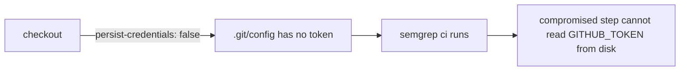

## Summary

Job `semgrep` in `.github/workflows/semgrep.yml` ran `actions/checkout` without
`persist-credentials: false`, so the workflow `GITHUB_TOKEN` was written into
`.git/config` as an auth header. The job only checks out the repo and runs
`semgrep ci` — it never pushes back to the repository or fetches private
submodules — so it does not need the persisted credential. Added
`persist-credentials: false` to the checkout step so the token is not written to
disk, reducing the blast radius of any compromised later step. Closes #324.

## Evidence

Backend/CI-only change — there is no web interface to screenshot. Verification:

- `actionlint .github/workflows/semgrep.yml` — no findings.
- YAML parses cleanly (`yaml.safe_load`).
- `./quality.sh` — all quality checks passed (workspace build, clippy, tests).



Diff:

```yaml
      - uses: actions/checkout@de0fac2e4500dabe0009e67214ff5f5447ce83dd
        with:
          persist-credentials: false
```

## Test Plan

- The change is a GitHub Actions workflow configuration hardening; no Rust code
  paths are affected, so no unit tests apply.
- Validated the workflow statically with `actionlint` (clean) and confirmed the
  YAML parses.
- Ran `./quality.sh` to confirm the workspace still builds, lints, and tests
  green.
