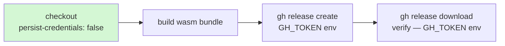

## Summary

Hardened the `publish` job's checkout in `.github/workflows/wasm-bundle.yml` by
adding `persist-credentials: false`. By default `actions/checkout` writes the
workflow `GITHUB_TOKEN` into `.git/config` as an auth header, where any later
step in the job — including a compromised dependency — can read it and act as
the token.

The `publish` job never pushes back through the git remote: it builds the
`wasm_activation` bundle and publishes the per-commit Release exclusively via the
`gh` CLI using `GH_TOKEN` from the environment (`Publish per-commit Release` and
`Verify published bundle` steps). It also fetches no private submodules. The
persisted checkout credential is therefore unused and only widens the blast
radius of a compromised step, so disabling it is safe.

This mirrors the same hardening already applied across the repo's other
workflows (Issues #317–#324: `actionlint.yml`, `ci.yml`, `gitleaks.yml`,
`markdown-lint.yml`, `release.yml`, `semgrep.yml`).

Closes #325.

## Evidence

Backend/CI configuration change — no web interface to screenshot.

Validation performed:

- The workflow YAML parses cleanly (`python3 -c "import yaml; yaml.safe_load(...)"` → `YAML OK`).
- Manual data-flow review confirms the `publish` job uses `GH_TOKEN` (env) for
  every GitHub operation and performs no `git push`/private-submodule fetch that
  would need the persisted credential.

The token is no longer written to `.git/config`; the release/verify steps rely
on `GH_TOKEN` from the environment, which is unaffected.

## Test Plan

No unit tests apply — this is a declarative GitHub Actions workflow security
setting with no callable function to exercise (consistent with the merged
sibling PRs #352–#354 for Issues #322–#324). Verified by:

- YAML schema/parse validation of `.github/workflows/wasm-bundle.yml`.
- Review confirming the checkout credential is genuinely unused by the job,
  ruling out the false-positive case called out in the issue.
