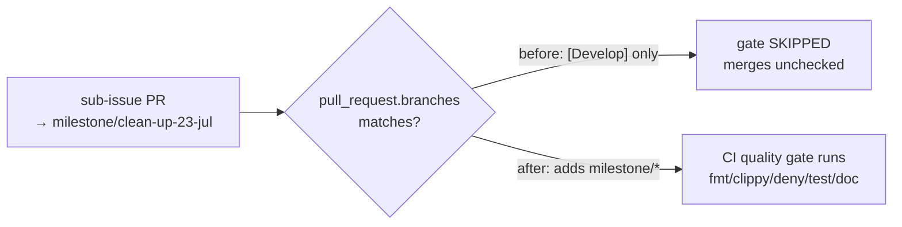

## Summary

The CI quality workflow (`.github/workflows/ci.yml`) gated PRs with a
`pull_request.branches` filter of `[Develop]` only. GitHub branch-filter globs
treat `*` as "any character except `/`", so milestone sub-issue PRs targeting a
shared `milestone/<slug>` branch never matched the filter — the fmt/clippy/deny/
test/doc gate silently skipped them, and they merged into the milestone branch
unchecked until the single rollup PR into `Develop` finally exercised the gate.

Added `milestone/*` to the filter so the quality gate runs on milestone PRs too,
while still gating PRs into `Develop`. Milestone branch names are
`milestone/<slug>` with no nested slashes, so the single-level `milestone/*`
glob is sufficient. Closes #327.

This mirrors the same fix already applied to `actionlint.yml` (Issue #326).



## Evidence

Backend/CI-config change — no web interface to screenshot. Verified via a new
bats test that models GitHub's branch-glob semantics (`*` does not cross `/`)
and asserts the filter matches `milestone/clean-up-23-jul` while still matching
`Develop`.

Before the fix (test 3 fails):

```
1..3
ok 1 ci workflow file exists
ok 2 ci workflow is valid YAML
not ok 3 ci workflow pull_request filter matches milestone branches
```

After the fix:

```
1..3
ok 1 ci workflow file exists
ok 2 ci workflow is valid YAML
ok 3 ci workflow pull_request filter matches milestone branches
```

`./quality.sh` passes cleanly (bash syntax, shellcheck, bats, TypeScript gate,
fmt/clippy/deny, workspace tests, doc, release build).

## Test Plan

- Added `tests/scripts/ci_workflow.bats`:
  - `ci workflow file exists` — the workflow YAML is present.
  - `ci workflow is valid YAML` — it parses.
  - `ci workflow pull_request filter matches milestone branches` — regression
    test reproducing #327: fails against the unfixed `[Develop]` filter, passes
    once `milestone/*` is added; also asserts `Develop` still matches.
