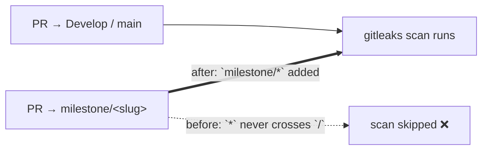

# Run the gitleaks secret scan on milestone PRs (Issue #328)

## Summary

`.github/workflows/gitleaks.yml` triggered on `pull_request` with
`branches: ["*"]`. GitHub branch-filter globbing treats `*` as "any character
except `/`", so the filter never matched a `milestone/<slug>` branch. Milestone
sub-issue PRs target a shared `milestone/<slug>` branch, so the secret scan was
silently skipped on every one of them — the leak would only be caught later by
the single rollup PR into the default branch.

Added an explicit `milestone/*` pattern to the filter
(`branches: ["*", "milestone/*"]`), mirroring the fix already landed for
`actionlint.yml` (Issue #326) and `ci.yml` (Issue #327). Milestone branch names
carry no nested slashes, so the single-level glob is sufficient.

Closes #328.

## Evidence

Backend/CI-configuration change — no web interface to screenshot. Verified by
the bats suite plus a local `actionlint` run over the edited workflow (clean).

Trigger coverage before and after:



Test run after the fix:

```text
1..7
ok 1 gitleaks.yml does not use the Node-based gitleaks-action
ok 2 gitleaks.yml installs gitleaks from a version-pinned release URL
ok 3 gitleaks.yml verifies the gitleaks tarball with sha256sum -c
ok 4 gitleaks.yml declares a 64-hex GITLEAKS_SHA256 env var
ok 5 gitleaks.yml declares a semver GITLEAKS_VERSION env var
ok 6 gitleaks.yml pull_request filter matches milestone branches
ok 7 gitleaks.yml invokes the gitleaks CLI
```

Before the workflow edit, test 6 failed (`not ok 6`) — a genuine
red-then-green regression test.

`./quality.sh < /dev/null` passes cleanly (exit 0).

## Test Plan

- Added `tests/scripts/gitleaks_pinned_install.bats::"gitleaks.yml
  pull_request filter matches milestone branches"` — parses the workflow YAML,
  re-implements GitHub's filter glob semantics (`*` does not cross `/`, `**`
  does), and asserts the `pull_request.branches` patterns match
  `milestone/clean-up-23-jul` while still matching `Develop` and `main`.
- Existing gitleaks workflow tests unchanged and still passing; no tests were
  removed or disabled.

## Security Self-Check

- No secrets or hidden files staged — only `.github/workflows/gitleaks.yml`
  (allowlisted workflow YAML), a bats test, and this summary.
- Change strictly widens a CI gate's coverage; no permissions, tokens, or
  script behaviour altered.
