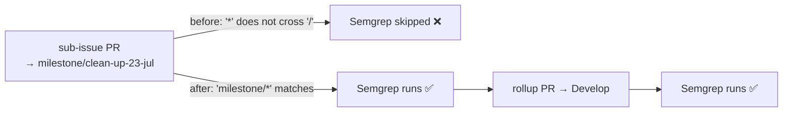

# Semgrep workflow now gates milestone PRs (Issue #330)

## Summary

`.github/workflows/semgrep.yml` filtered pull requests on `branches: ["*"]`.
GitHub branch-filter globs treat `*` as "any chars **except** `/`", so a bare
`"*"` never matches a `milestone/<slug>` branch. Milestone sub-issue PRs target
a shared `milestone/<name>` branch, so every one of them merged without the
Semgrep scan running — the gap only surfaced later on the single rollup PR into
the default branch.

Added an explicit `milestone/*` pattern so the scan runs on milestone sub-issue
PRs too. This mirrors the fixes already landed for `gitleaks.yml` (Issue #328)
and `markdown-lint.yml` (Issue #329). Closes #330.



## Evidence

Backend/CI-config change only — no web interface to screenshot.

`tests/scripts/semgrep_workflow.bats` expands the workflow's branch patterns
using GitHub's own globbing rules (`**` crosses `/`, `*` does not) and asserts
`milestone/clean-up-23-jul` matches while `Develop` and `main` still do.

Before the fix:

```text
not ok 2 semgrep.yml pull_request filter matches milestone branches
```

After the fix:

```text
1..3
ok 1 semgrep.yml exists and is valid YAML
ok 2 semgrep.yml pull_request filter matches milestone branches
ok 3 semgrep.yml runs the semgrep scan on pull requests
```

`./quality.sh` passes cleanly (bats, shellcheck, deno check, clippy, cargo
test, doc, release build), and `actionlint .github/workflows/semgrep.yml`
reports no findings.

## Test Plan

- Added `tests/scripts/semgrep_workflow.bats`:
  - `semgrep.yml exists and is valid YAML`
  - `semgrep.yml pull_request filter matches milestone branches` — the
    regression test for this issue; fails against the unfixed workflow.
  - `semgrep.yml runs the semgrep scan on pull requests` — guards against the
    filter being "fixed" on a workflow that no longer scans anything.
- Picked up automatically by `quality.sh` (`bats tests/scripts`) and the CI
  bats gate; no existing tests were modified or removed.
