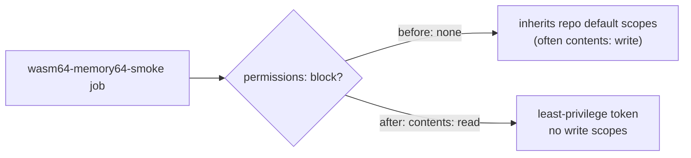

# Least-privilege `permissions:` for the `wasm64-memory64-smoke` CI job

## Summary

The `wasm64-memory64-smoke` job in `.github/workflows/ci.yml` declared no
`permissions:` block at either job or workflow level, so it inherited the
repository's broad default `GITHUB_TOKEN` scopes (typically `contents: write`
and more). The job only checks out the repo, installs Deno, and runs one
committed smoke test — it never writes — so it now declares the least-privilege
set it actually needs: `contents: read`. Closes #331.

This follows the same pattern already applied to `quality`, `rust-gates`,
`scripts-and-spelling`, `security`, and `validation` (Issues #311–#313).

## Evidence

Backend/CI-only change — no web interface to screenshot. Verified by the new
bats contract test, which parses `ci.yml` as YAML and asserts on the resolved
permissions of the job (job-level block, falling back to workflow-level).

Test run before the fix (red):

```text
1..3
ok 1 ci workflow file exists
not ok 2 wasm64-memory64-smoke job declares an explicit permissions block
not ok 3 wasm64-memory64-smoke job grants read-only contents and no write scopes
```

Test run after the fix (green):

```text
1..3
ok 1 ci workflow file exists
ok 2 wasm64-memory64-smoke job declares an explicit permissions block
ok 3 wasm64-memory64-smoke job grants read-only contents and no write scopes
```

`./quality.sh` passes cleanly (`✅ All quality checks passed!`).



## Test Plan

- Added `tests/scripts/ci_wasm64_memory64_smoke_permissions.bats`:
  - `ci workflow file exists`
  - `wasm64-memory64-smoke job declares an explicit permissions block` — fails
    against the unfixed workflow, passes after the fix (regression test).
  - `wasm64-memory64-smoke job grants read-only contents and no write scopes` —
    asserts `contents: read` and that no scope is granted `write`.
- No existing tests were modified or removed; full `./quality.sh` gate
  (rustfmt, clippy, cargo-deny, bats, workspace tests, docs, release build)
  passes.
