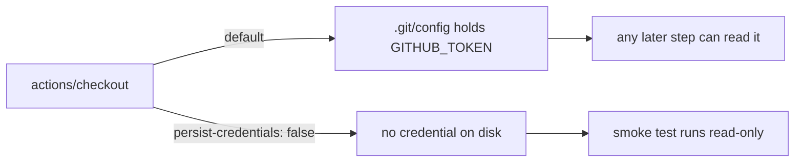

# PR Summary — Issue #332

## Summary

The `wasm64-memory64-smoke` job in `.github/workflows/ci.yml` checked out the
repository without `persist-credentials: false`, so `actions/checkout` wrote the
workflow `GITHUB_TOKEN` into `.git/config` as an auth header. Every later step
in that job — including a compromised action or injected script — could read the
credential and act as the token. The job is read-only (checkout, install Deno,
run one committed Memory64 smoke test): it never pushes back and fetches no
private submodule, so the persisted credential was pure blast radius.

`persist-credentials: false` is now set on that checkout step, keeping the token
off disk. Closes #332.

## Evidence

This is a CI-workflow security-hardening change with no web interface, so no
screenshot applies. Verification is by test: a new BATS suite parses `ci.yml` as
YAML and asserts the observable CI contract — every `actions/checkout` step in
the `wasm64-memory64-smoke` job sets `persist-credentials: false`. The test
failed against the unfixed workflow and passes after the change.

```text
$ bats tests/scripts/ci_wasm64_memory64_smoke_checkout.bats   # before the fix
ok 1 ci workflow defines a wasm64-memory64-smoke job
not ok 2 ci wasm64-memory64-smoke checkout does not persist credentials on disk

$ bats tests/scripts/ci_wasm64_memory64_smoke_checkout.bats   # after the fix
ok 1 ci workflow defines a wasm64-memory64-smoke job
ok 2 ci wasm64-memory64-smoke checkout does not persist credentials on disk
```



`./quality.sh` passes cleanly (fmt, clippy, deny, shellcheck, BATS, workspace
tests, docs, release build).

## Test Plan

- Added `tests/scripts/ci_wasm64_memory64_smoke_checkout.bats`:
  - `ci workflow defines a wasm64-memory64-smoke job` — the job still exists
    under the expected key.
  - `ci wasm64-memory64-smoke checkout does not persist credentials on disk` —
    regression test that fails on the unfixed workflow; every checkout step in
    the job must set `persist-credentials: false`.
- Existing `tests/scripts/ci_wasm64_memory64_smoke_permissions.bats` (Issue
  #331) continues to pass, confirming the least-privilege `permissions:` block
  is untouched.
