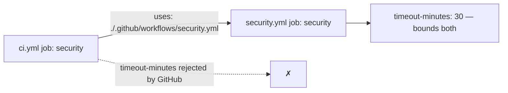

# PR Summary — Issue #333

## Summary

None of the jobs across the repository's 9 workflow files declared a job-level
`timeout-minutes:`, so every job inherited GitHub's default of **6 hours**. A
wedged step — a hung `cargo` build, a stalled network fetch in `bump-deps.sh`,
a `deno test` waiting on stdin — held a runner for the full six hours, burning
the Actions minutes quota and blocking queued runs.

Every runner job now declares an explicit budget, sized generously above its
normal wall clock and annotated with what it covers. `Closes #333`.

| Workflow | Job | `timeout-minutes` |
| --- | --- | --- |
| `ci.yml` | `version-increment` | 15 |
| `ci.yml` | `version-gate` | 10 |
| `ci.yml` | `auto-format` | 20 |
| `ci.yml` | `quality` | 45 |
| `ci.yml` | `rust-gates` | 45 |
| `ci.yml` | `typescript-gate` | 10 |
| `ci.yml` | `scripts-and-spelling` | 15 |
| `ci.yml` | `wasm64-memory64-smoke` | 10 |
| `ci.yml` | `validation` | 15 |
| `security.yml` | `security` | 30 |
| `actionlint.yml` | `actionlint` | 10 |
| `gitleaks.yml` | `gitleaks` | 15 |
| `markdown-lint.yml` | `markdownlint` | 10 |
| `release.yml` | `release` | 15 |
| `semgrep.yml` | `semgrep` | 20 |
| `upgrade-dependencies.yml` | `upgrade` | 45 |
| `wasm-bundle.yml` | `publish` | 45 |

### Reusable-workflow caller carve-out

`ci.yml`'s `security` job is a reusable-workflow **caller**
(`uses: ./.github/workflows/security.yml`). GitHub rejects `timeout-minutes` on
a calling job, so the budget lives on the called workflow's own `security` job
instead — which bounds the caller just the same.



## Evidence

Backend/CI-configuration change only — there is no web interface to
screenshot. Verified by the test suite and by `actionlint`:

- `bats tests/scripts` — **231 tests, 0 failures** (4 of them new, see below).
- `actionlint -no-color -ignore 'SC2016' .github/workflows/*.yml` — exit 0,
  confirming no `timeout-minutes` landed anywhere GitHub would reject it.
- `./quality.sh < /dev/null` — passed cleanly end to end (shellcheck, bats,
  `deno check`, codespell, `cargo deny`, fmt, clippy, check, tests, docs,
  release build).

The new tests fail against the pre-fix tree and pass after the change:

```text
# before
not ok 1 every runner job in every workflow declares a job-level timeout-minutes
not ok 3 compile-heavy jobs budget at least 30 minutes

# after
ok 1 every runner job in every workflow declares a job-level timeout-minutes
ok 2 every declared timeout-minutes is a positive integer no greater than 60
ok 3 compile-heavy jobs budget at least 30 minutes
ok 4 reusable-workflow callers carry no timeout-minutes and the callee does
```

## Test Plan

Added `tests/scripts/workflow_job_timeouts.bats` — "what" tests that parse the
workflow YAML and assert on the effective configuration, not on source text:

1. `every runner job in every workflow declares a job-level timeout-minutes` —
   regression test for the reported defect; covers all workflows, so a new
   workflow added later without a budget fails CI.
2. `every declared timeout-minutes is a positive integer no greater than 60` —
   edge case: rejects `0`, negatives, booleans, strings, and runaway budgets.
3. `compile-heavy jobs budget at least 30 minutes` — guards the other
   direction, so a later edit cannot starve `quality`, `rust-gates`,
   `security`, `upgrade`, or `publish` mid-build.
4. `reusable-workflow callers carry no timeout-minutes and the callee does` —
   error path: pins the GitHub restriction that would otherwise produce an
   invalid workflow, and asserts the callee still carries a budget.

No existing tests were modified or removed.
