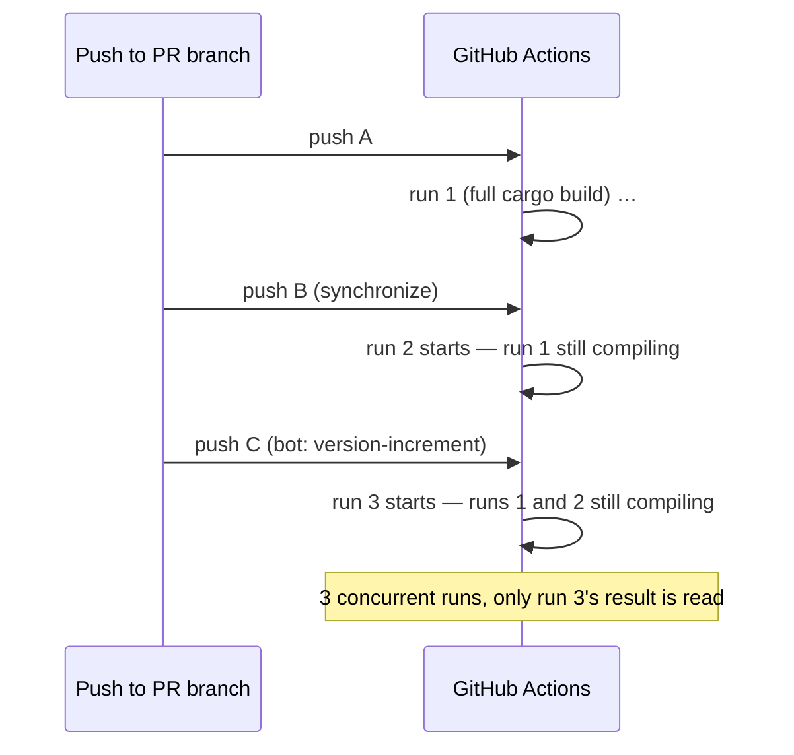
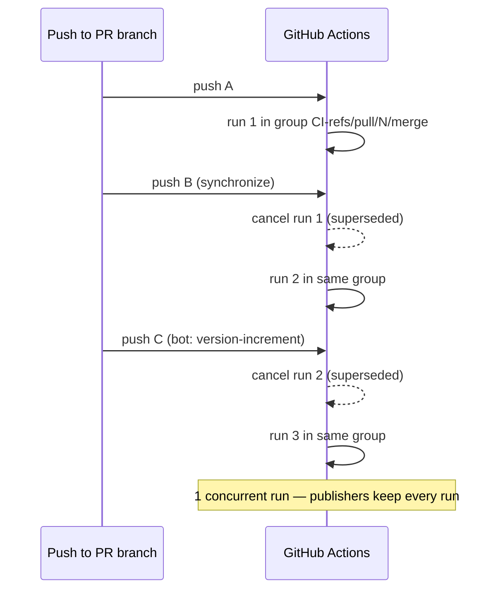

# PR Summary — Issue #334

## Summary

Added a top-level `concurrency:` group with `cancel-in-progress: true` to the
five pile-up-prone PR/push gates — `ci.yml`, `actionlint.yml`, `gitleaks.yml`,
`markdown-lint.yml` and `semgrep.yml`. Every `synchronize` push to an open PR
previously queued a fresh run while the previous one was still compiling; on
`ci.yml`, where a single run compiles the workspace several times over, a few
rapid pushes (including the bot pushes from `version-increment`/`auto-format`)
stacked runs several deep, burning runner minutes on results nobody reads.
Each group is keyed on `github.workflow` **and** `github.ref`, so one live run
is kept per workflow per branch and no workflow can cancel another's run.

`release.yml` and `wasm-bundle.yml` are deliberately left uncancelled: both
publish a per-version tag or per-commit bundle that downstream consumers pin by
SHA, and cancelling a superseded run would silently skip an artefact. The
reusable `security.yml` declares no group of its own — it runs inside the
caller's context, so its own group would let one caller cancel another caller's
in-flight scan.

Closes #334.

## Evidence

Workflow/CI change with no web interface to screenshot. Verified by parsing the
committed workflow YAML in a new bats suite (below) and by `actionlint`, which
reports no new findings for the five edited files.

Before — every push starts a new run and the old one keeps compiling:



After — the group keeps one live run per workflow per ref:



Local run of the new suite:

```text
$ bats tests/scripts/workflow_concurrency_groups.bats < /dev/null
1..4
ok 1 pile-up-prone workflows cancel superseded runs per ref
ok 2 each gated workflow's concurrency group is distinct for the same ref
ok 3 publishing workflows never cancel in-progress runs
ok 4 the reusable security workflow declares no concurrency group
```

Full gate: `bats tests/scripts` → 240 passing, 0 failing; `./quality.sh` exits 0
(fmt, clippy `-D warnings`, cargo-deny, `cargo test --workspace`, docs, release
build).

## Test Plan

Added `tests/scripts/workflow_concurrency_groups.bats` — "what" tests that parse
the workflow YAML and assert on the effective configuration, not on source text:

- **`pile-up-prone workflows cancel superseded runs per ref`** — each of the
  five gates declares a `concurrency` mapping whose group references both
  `github.workflow` and `github.ref`, with `cancel-in-progress: true`. This is
  the regression test: it fails against the pre-fix workflows (verified — it
  reported "no top-level concurrency mapping" for all five) and passes after.
- **`each gated workflow's concurrency group is distinct for the same ref`** —
  resolves `github.workflow` to each workflow's declared `name` and asserts no
  two workflows land in the same group, so gitleaks can never cancel CI.
- **`publishing workflows never cancel in-progress runs`** — `release.yml` and
  `wasm-bundle.yml` must not set `cancel-in-progress: true` at workflow or job
  level (edge case: no group at all is also acceptable).
- **`the reusable security workflow declares no concurrency group`** —
  `security.yml` stays a `workflow_call` workflow with no group of its own.

No existing tests were modified or removed.

## Security Self-Check

- No secrets, credentials or `.config*.json` files staged; the only hidden paths
  touched are `.github/workflows/*.yml`, which the allowlist permits.
- No new dependencies, network calls, shell interpolation or user input surface —
  the change is five declarative YAML keys plus a test file.
- `cancel-in-progress` is scoped away from the publishing workflows, so no
  signed/attested artefact can be skipped by a cancellation.
