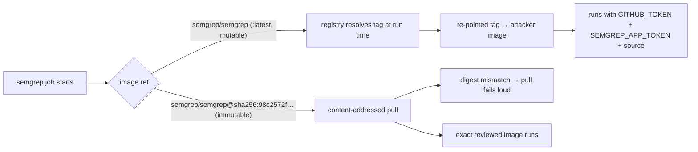

# Pin the Semgrep container image by digest (Issue #335)

## Summary

`.github/workflows/semgrep.yml` ran its `semgrep` job inside a container
referenced by the bare image name `semgrep/semgrep`, which resolves to the
mutable `:latest` tag. The registry owner — or anyone who compromises the
`semgrep/semgrep` Docker Hub account — can re-point that tag at any time, and
the substituted image would then execute with this job's `GITHUB_TOKEN`,
`SEMGREP_APP_TOKEN` and the fully checked-out source in scope. It was the last
mutable third-party reference in the repo's workflows: `uses:` steps are pinned
to 40-char commit SHAs (Issue #77) and CLI installs to SHA-256-verified
tarballs (Issues #78/#96/#99).

The image is now pinned by digest — content-addressed and immutable — with the
human-readable tag kept in a comment, and a new workflow-wide bats gate keeps
any future container or service image from regressing to a mutable reference.

Closes #335.

## Changes

- **`.github/workflows/semgrep.yml`** — `image: semgrep/semgrep` →
  `image: semgrep/semgrep@sha256:98c2572f…d9941`, the digest `:latest`
  currently resolves to (`semgrep/semgrep:1.170.1`). A comment records the tag
  and the `docker buildx imagetools inspect semgrep/semgrep:latest` command
  used to refresh it, so the digest is bumped deliberately on the same cadence
  as the other pinned tools.
- **`tests/scripts/workflow_container_pinning.bats`** (new) — a repo-wide gate,
  not a semgrep-specific one: every job `container:` and `services:` image in
  every workflow must be pinned as `@sha256:<64-hex>` and carry a version
  comment.

## Evidence

This is a CI/workflow change with no web interface, so there is no screenshot
to capture. The evidence is the bats suite: the new digest gate fails against
the unfixed workflow and passes after the pin.

Before the fix (red — TDD):

```text
not ok 1 every job container and service image is pinned to a sha256 digest
# Unpinned container images:
#   semgrep.yml job=semgrep container=semgrep/semgrep
ok 2 every digest-pinned image carries a human-readable version comment
ok 3 digest regex rejects bare image names and mutable tags
```

After the fix (green), and the full shell suite alongside it:

```text
1..3
ok 1 every job container and service image is pinned to a sha256 digest
ok 2 every digest-pinned image carries a human-readable version comment
ok 3 digest regex rejects bare image names and mutable tags

$ bats tests/scripts   # full suite
243 passing, 0 failing
```

The attack this closes, and where the pin cuts it:



## Test Plan

Added `tests/scripts/workflow_container_pinning.bats`:

- `every job container and service image is pinned to a sha256 digest` —
  parses every workflow's YAML and asserts each job `container:`/`services:`
  image ref matches `@sha256:<64-hex>`. This is the regression test: it fails
  against the pre-fix `image: semgrep/semgrep` and passes after the pin.
- `every digest-pinned image carries a human-readable version comment` — a
  digest alone is unreviewable, so the tag must be named inline or on the line
  above.
- `digest regex rejects bare image names and mutable tags` — behavioural check
  that the gate rejects `semgrep/semgrep`, `:latest`, a plain `:1.170.1` tag
  and a truncated digest, so a weakened regex is caught.

Existing `tests/scripts/semgrep_workflow.bats` still passes unchanged (valid
YAML, milestone branch filter, scan step) — no test was modified or removed.

## Security self-check

- **Input validation** — no new runtime input surface; the change is a workflow
  image ref.
- **Secrets** — no secrets staged; only `.github/workflows/semgrep.yml` (the
  worker holds the `workflow` OAuth scope) and a new test file.
- **Injection surface** — none added; no new `run:` blocks or context
  interpolation.
- **Dependencies** — the container is an external dependency pinned to an
  immutable digest published 2026-07-21, comfortably outside the 24h
  quarantine window.
