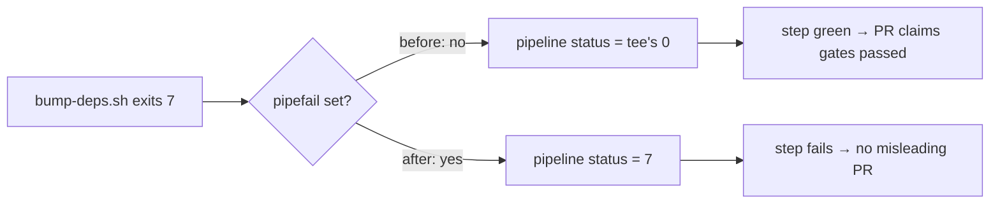

# PR Summary — Issue #336

## Summary

`.github/workflows/upgrade-dependencies.yml` ran its "Refresh dependencies via
`bump-deps.sh` (quarantine-aware)" step under GitHub's default `bash -e` — `-e`
but **no `pipefail`**. Because the command pipes into `tee upgrade.log`, the
step's exit status was `tee`'s (always 0), so a non-zero exit from
`bump-deps.sh` (release-age quarantine violation, `cargo audit` advisory, or a
failed native/wasm build) was swallowed. The workflow then proceeded to open a
PR whose body asserts the bumps "have passed `cargo audit` plus dual
native/wasm builds" — a claim that could be false, silently re-opening the
supply-chain window Issue #76 closed.

Added `set -euo pipefail` to that step so the pipeline reports the script's
failure. `tee` still captures the log the PR body pastes. The PR-path caller in
`ci.yml` already set `set -euo pipefail`, so only this scheduled path changed.

Closes #336.

## Evidence

Backend/CI-only change — no web interface to screenshot. Evidence is the new
behavioural bats suite, which executes the workflow step's real script.

Failure signal before and after the fix:



Tests fail against the unfixed workflow and pass after the fix:

```text
# before (workflow without pipefail)
not ok 1 a failing bump-deps.sh fails the scheduled upgrade step
ok 2 a passing bump-deps.sh keeps the scheduled upgrade step green
ok 3 the scheduled upgrade step still captures bump-deps.sh output to upgrade.log
not ok 4 every piped run: block in upgrade-dependencies.yml runs under pipefail

# after
ok 1 a failing bump-deps.sh fails the scheduled upgrade step
ok 2 a passing bump-deps.sh keeps the scheduled upgrade step green
ok 3 the scheduled upgrade step still captures bump-deps.sh output to upgrade.log
ok 4 every piped run: block in upgrade-dependencies.yml runs under pipefail
```

Full suite: `bats tests/scripts` — 247 passing, 0 failing.
`./quality.sh < /dev/null` — "All quality checks passed!".

## Test Plan

New `tests/scripts/workflow_pipefail.bats` — "what" tests that parse the
workflow, extract the step's actual `run:` body, and execute it under the exact
shell GitHub would use (`bash -e` with no `shell:`, `bash --noprofile --norc
-eo pipefail` when `shell: bash` is declared), with a stub `bump-deps.sh`:

- `a failing bump-deps.sh fails the scheduled upgrade step` — regression test
  for #336; stub exits 7, step must exit non-zero.
- `a passing bump-deps.sh keeps the scheduled upgrade step green` — stub exits
  0, step must stay green (guards against over-strict `-e` breakage).
- `the scheduled upgrade step still captures bump-deps.sh output to
  upgrade.log` — `tee` still writes the log the PR body pastes, including the
  `--quarantine-hours 24` argument.
- `every piped run: block in upgrade-dependencies.yml runs under pipefail` —
  forward guard so a future piped command in this workflow cannot reintroduce
  the swallowed exit status.

No existing tests were modified or removed.

## Security Self-Check

- Input validation: no new external input paths.
- Secrets: only the workflow YAML and a bats file are staged; no `.env` /
  `.config*.json`.
- Injection surface: the test harness heredocs are quoted (`<<'PY'`), so
  GitHub `${{ … }}` expressions are never evaluated by the shell; the stub runs
  in `$BATS_TEST_TMPDIR`.
- Error handling: the change makes failures louder, not quieter — a masked
  failure is now surfaced as a failed step.
- Dependencies: none added.
