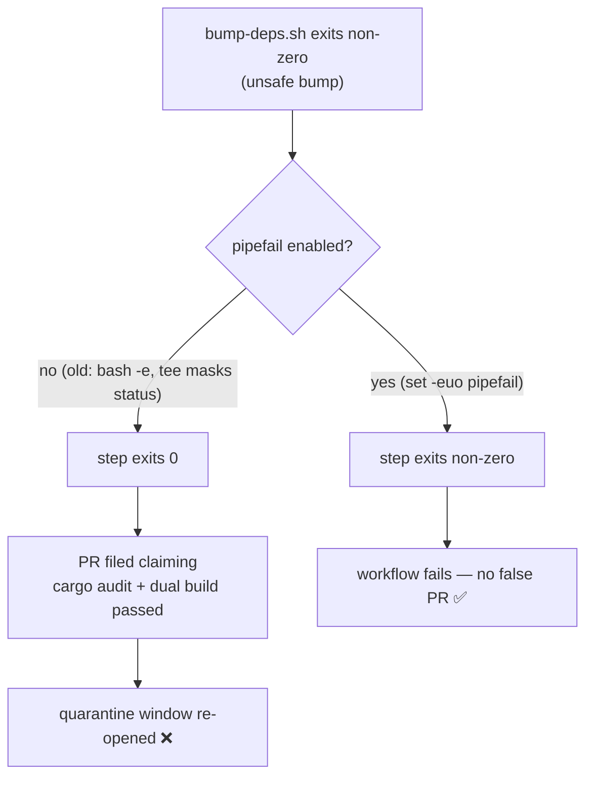

## Summary

`.github/workflows/upgrade-dependencies.yml` piped `bump-deps.sh` through
`tee upgrade.log` in a step with no `shell:` override. GitHub runs an
unspecified-shell `run` as `bash -e {0}` **without** `pipefail`, so the
pipeline's exit status was `tee`'s (always 0). A non-zero exit from
`bump-deps.sh` — the documented "the bump is unsafe" signal (release-age
quarantine violation, `cargo audit` advisory, or a failed native/wasm build) —
was therefore swallowed, and the workflow went on to file a PR asserting the
bumps "have passed `cargo audit` plus dual native/wasm builds", a claim that
could be false. This silently re-opened the fast-flagged supply-chain window the
quarantine (Issue #76) was built to close. Only the scheduled path was affected;
the PR-path caller in `ci.yml` already sets `set -euo pipefail`.

The fix adds `set -euo pipefail` to the Refresh step's `run` body so a failed
`bump-deps.sh` fails the step, matching the guard the `ci.yml` bump path already
uses.

Closes #336.

## Evidence

Backend/CI workflow change — no web interface to screenshot. Verified via a
behavioural bats regression test that executes the step's **actual** `run` body
(extracted from the workflow YAML) against a failing and a succeeding stubbed
`bump-deps.sh`, reproducing GitHub's default `bash -e` (no pipefail) shell.

Regression linkage — the test fails against the unfixed workflow and passes with
the fix:

```
# unfixed (fix stashed)
not ok 3 a failing bump-deps.sh fails the Refresh step (pipefail is enabled)

# fixed
ok 1 upgrade-dependencies.yml exists
ok 2 the Refresh step run body is extractable and invokes bump-deps.sh via tee
ok 3 a failing bump-deps.sh fails the Refresh step (pipefail is enabled)
ok 4 a succeeding bump-deps.sh still passes the Refresh step
```

`./quality.sh` passes cleanly (bash syntax, shellcheck, full bats suite,
`cargo test --workspace`, docs, release build).



## Test Plan

- Added `tests/scripts/upgrade_dependencies_pipefail.bats`:
  - `a failing bump-deps.sh fails the Refresh step (pipefail is enabled)` —
    reproduces #336; fails without the fix, passes with it.
  - `a succeeding bump-deps.sh still passes the Refresh step` — guards against
    over-correction.
  - `the Refresh step run body is extractable and invokes bump-deps.sh via tee`
    — pins the step shape the behavioural tests rely on.
- `./quality.sh` run to completion: all checks pass.
