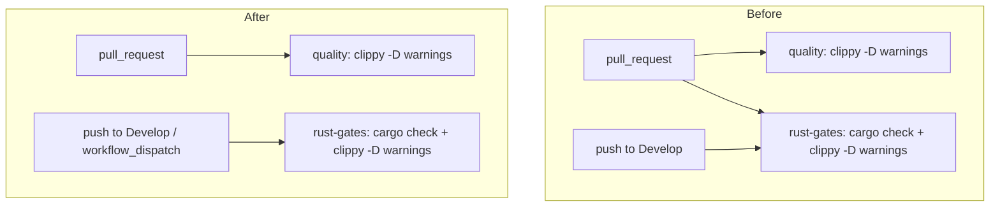

## Summary

`.github/workflows/ci.yml` ran the identical lint recipe twice on every pull
request: job `quality` step "Run linter" and job `rust-gates` step "Lint gate
(cargo clippy)" both invoked
`cargo clippy --workspace --all-targets --all-features -- -D warnings`, plus a
`cargo check --workspace --all-targets --all-features` that clippy's own
compilation already subsumes. Two jobs with separate caches compiled and linted
the whole workspace, roughly doubling the heaviest part of the CI bill on every
PR.

`rust-gates` is now scoped to the events `quality` does not cover
(`if: github.event_name != 'pull_request'`), which preserves its stated purpose
from Issue #143 — gating direct pushes to `Develop`, which skip the PR-only
jobs — while `quality` stays the comprehensive PR gate (fmt, deny, clippy,
tests, docs). `Lint & Compile Gates` is not a required status check in
`.github/rulesets/develop.json`, so skipping it on PRs does not block merges.

Closes #337.

## Evidence

Backend/CI-only change — no web interface to screenshot. Verified by the
`bats` contract tests over the parsed workflow YAML.



Test run (`bats tests/scripts/rust_gates_workflow.bats`) — the new test fails
against the unfixed workflow and passes after the change:

```text
1..9
ok 1 ci workflow file exists
ok 2 ci workflow is valid YAML
ok 3 ci workflow triggers on PRs and on pushes to Develop
ok 4 ci workflow runs a clippy lint gate with -D warnings
ok 5 ci workflow runs an explicit compile/syntax gate (cargo check or build)
ok 6 ci workflow gates lint + compile on push (not pull_request only)
ok 7 exactly one job runs the clippy lint gate on a pull_request event
ok 8 ci workflow pins third-party actions to commit SHAs
ok 9 ci rust-gates checkout does not persist credentials on disk
```

Full suite: `bats tests/scripts` — 248/248 pass. `./quality.sh` passes cleanly.
`actionlint .github/workflows/ci.yml` reports no findings.

## Test Plan

- **Added** `tests/scripts/rust_gates_workflow.bats::"exactly one job runs the
  clippy lint gate on a pull_request event"` — regression test for the
  duplicate gate. It parses `ci.yml`, keeps the jobs whose `if:` allows a
  `pull_request` event, and asserts exactly one of them carries a
  `cargo clippy … -D warnings` step. Fails against the unfixed workflow (two
  jobs), passes after.
- **Modified** (documented business-logic change)
  `tests/scripts/rust_gates_workflow.bats::"ci workflow gates lint + compile on
  push (not pull_request only)"` — it previously asserted the gate job's `if:`
  text did not contain the substring `pull_request`, which cannot distinguish
  `github.event_name == 'pull_request'` (PR only — the condition it meant to
  reject) from `github.event_name != 'pull_request'` (everything *but* a PR —
  which satisfies the same contract). It now evaluates the condition against a
  `push` event via a shared `runs_on(job, event)` helper, so it still asserts
  the same observable outcome: direct pushes to `Develop` hit the lint +
  compile gate. No test was removed or commented out.
- **Unchanged and still passing**: the compile/syntax-gate test (clippy's own
  compilation covers PRs; `rust-gates` still runs `cargo check --all-targets`
  on pushes), the SHA-pinning test, the `persist-credentials` test
  (Issue #318), and `ci_rust_gates_permissions.bats` (Issue #310).
- Documentation: the `ci.yml` row in `README.md` now describes which events
  each job gates.
