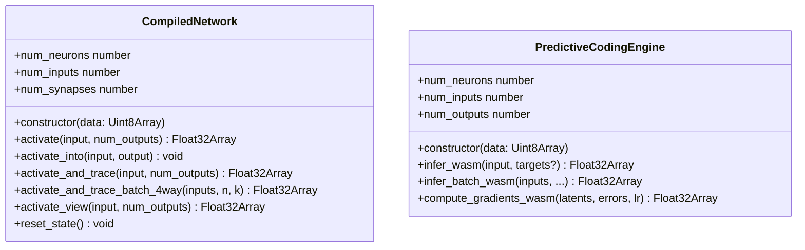

## Summary

Annotates `CompiledNetwork`, `PredictiveCodingEngine`, and the supporting free functions with `#[wasm_bindgen]` so `wasm-pack build neat-core --target web --out-name wasm_activation` reproduces the JS class surface NEAT-AI consumes today. All annotations are gated behind `cfg(target_arch = "wasm32")` (or `cfg_attr`) — native consumers (`rust_scorer`, CLI, native tests) compile unchanged. Closes #36.

Key changes:

- `neat-core/Cargo.toml`: added `cdylib` to `crate-type` alongside `rlib`. `rlib` is what native crates link against, so `rust_scorer` is unaffected.
- `network.rs`: `CompiledNetwork` is now `#[wasm_bindgen]` with `#[wasm_bindgen(skip)]` on every public field, `#[wasm_bindgen(constructor)]` on `new`, `#[wasm_bindgen(getter)]` on `num_neurons`/`num_inputs`/`num_synapses`, and a new safe `activate_view` method that mirrors `activate` (no `unsafe` block, per acceptance criterion).
- `pc_inference.rs` + `pc_learning.rs`: `PredictiveCodingEngine` annotated the same way; the JS-facing `impl` blocks (containing `new`, `infer_wasm`, `infer_batch_wasm`, `compute_gradients_wasm`, and the three getters) are wrapped in `#[cfg_attr(target_arch = "wasm32", wasm_bindgen)]`. The pure-Rust `impl` block (`new_from_parts`, `infer`, `infer_batch`) remains unannotated so native callers keep using `PcInferenceResult` directly.
- `accumulate.rs`, `topology_ops.rs`: pre-existing annotations kept; rest of the audit handled below.
- `training_state.rs`, `loss.rs`, `elastic_distribution.rs`: 13 free functions annotated inline (no rename needed) — `init_training_state`, `reset_training_state`, `free_training_state`, `read_*_state`, `get_training_state_num_*`, `accumulate_*_persistent_*way`, `mse/mae/cross_entropy/mape/msle/hinge_sum_batch_packed`, `distribute_elastic_error`.
- New `wasm_exports.rs` (wasm32-only): thin `#[wasm_bindgen]` shims for the cases that need a JS-name rename (`apply_squash` → `squash`, etc.), tuple-to-`Vec` repackaging (`compute_score_components`, `scan_max_*`, `apply_get_range`, `apply_derivative_simd_4way`, `apply_calculate_error_batch_4way`), and the byte-packed `propagate_topological` ABI that decodes input, calls `propagate_topological_loop`, and re-encodes the output with the TS↔WASM sentinel contract (`-Infinity` = `NoChange`, `+Infinity` = `Special`).
- `version()` shim returning `env!("CARGO_PKG_VERSION")`.

Acceptance criteria check:

- `wasm-pack build neat-core --target web --out-name wasm_activation --out-dir /tmp/pkg-test` produces a `wasm_activation.d.ts` whose **53 free functions and 2 classes form a strict superset of the canonical NEAT-AI vendored .d.ts** (verified by `comm -23` returning empty — see Evidence).
- `cargo test --workspace --lib --tests --all-features` passes (all 122 lib tests + 19 integration suites green, including the 7 new tests added in `tests/wasm_bindgen_surface.rs`).
- `cargo build --target wasm32-unknown-unknown` succeeds from the workspace root.
- No new `unsafe` blocks; `activate_view` returns a copy instead of a zero-copy view to satisfy this constraint.
- Public field access (`net.neurons`, `engine.connections`, etc.) preserved for `rust_scorer` and other native consumers — verified by the new `*_public_fields_remain_accessible` tests.

## Evidence

CLI / library change with no UI surface, so visual evidence is not applicable. Verification artefacts:

```text
$ comm -23 /tmp/canonical_exports.txt /tmp/new_exports.txt
$  # ← empty: every canonical export is present in the new build

$ wasm-pack build neat-core --target web --out-name wasm_activation --out-dir /tmp/pkg-test
[INFO]: ✨   Done in 4.56s
[INFO]: 📦   Your wasm pkg is ready to publish at /tmp/pkg-test.

$ cargo test --test wasm_bindgen_surface
test result: ok. 7 passed; 0 failed; 0 ignored
```

Generated surface:



## Test Plan

- `tests/wasm_bindgen_surface.rs` (new) — 7 tests covering:
  - `compiled_network_constructor_succeeds` — `CompiledNetwork::new` still parses bytes.
  - `compiled_network_public_fields_remain_accessible` — `pub` field access compiles (regression guard for `rust_scorer`).
  - `activate_view_matches_activate` — new `activate_view` returns the same outputs as `activate` and matches the expected analytical value.
  - `reset_state_clears_non_input_activations` — `reset_state` behaviour preserved.
  - `pc_engine_constructor_and_getters` — `PredictiveCodingEngine::new` byte parser still works; getters return correct counts.
  - `pc_engine_public_fields_remain_accessible` — same regression guard for the PC engine.
  - `pc_engine_infer_wasm_packs_header_and_body` — `infer_wasm` still produces the documented packed layout.
- All pre-existing tests continue to pass (`./quality.sh` green: rustfmt, clippy `-D warnings`, type checks, full test suite, doc build, release build).
- Manual verification: `wasm-pack build` produces a `.d.ts` whose exports are a strict superset of NEAT-AI's vendored `wasm_activation/pkg/wasm_activation.d.ts` (verified with `comm -23`).
