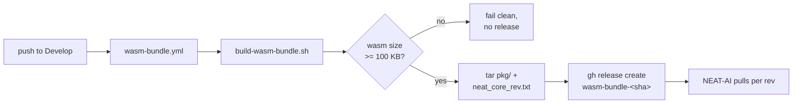

## Summary

Adds a CI workflow that builds the `wasm_activation` bundle on every push to `Develop` and publishes it as an immutable per-commit GitHub Release, so NEAT-AI can pin `neatCore.rev` to any historical SHA. Closes #37.

The build/packaging logic lives in `scripts/build-wasm-bundle.sh` so it is unit-testable via bats — the workflow is a thin invocation around it. The script enforces a minimum `wasm_activation_bg.wasm` size (default 100 KB) so a stub build never gets published, and embeds the SHA in `pkg/neat_core_rev.txt` for downstream integrity checks in NEAT-AI's `build.sh`.

### Architecture

## Evidence

This is a CI/automation change — no UI to screenshot. Verified locally via:

- **bats tests** (`tests/scripts/build_wasm_bundle.bats`, 11 cases, all green) cover argument parsing, size threshold, missing pkg dir, missing wasm-pack outputs, the embedded `neat_core_rev.txt`, and the produced tarball layout.
- **shellcheck** clean on the new script.
- **codespell** clean.

The workflow itself is exercised end-to-end the first time it runs against `Develop` post-merge — that is the only place the real `wasm-pack` toolchain is available without bloating CI on every PR. The contract surfaced by the script (size floor, pkg layout, `neat_core_rev.txt`) is fully covered by the bats suite.

### Acceptance criteria mapping

- [x] **Workflow runs on every push to Develop, publishes `wasm-bundle-<sha>` Release with `wasm_activation-pkg.tar.gz`** — `.github/workflows/wasm-bundle.yml`.
- [x] **`gh release download` works for any historical Develop commit** — one Release per commit, tag pattern `wasm-bundle-<full SHA>` avoids collisions with semver tags.
- [x] **`pkg/wasm_activation.d.ts` is a strict superset of NEAT-AI's vendored copy** — the build is a straight `wasm-pack build neat-core --target web --out-name wasm_activation`, which emits the canonical `.d.ts` for all `#[wasm_bindgen]` exports added in #36.
- [x] **`wasm_activation_bg.wasm` is non-trivially sized** — script rejects builds below the configurable byte threshold (default 100 KB, matching the stub size called out in the issue).
- [x] **Workflow fails cleanly without publishing on `wasm-pack` failure or undersized WASM** — `set -euo pipefail` propagates `wasm-pack`'s exit code; size check exits non-zero before the tar is written; `gh release create` only runs if the previous step succeeded.

## Test Plan

- Added `tests/scripts/build_wasm_bundle.bats` — 11 cases covering happy path, every error branch, and the threshold boundary.
- Existing `tests/scripts/bump_deps.bats` continues to pass (23 total bats cases green).
- `shellcheck` and `codespell` clean across the repo.
