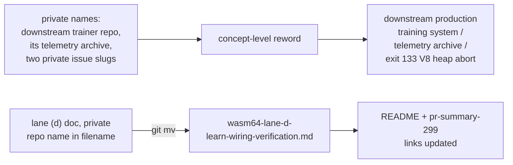

## Summary

Reworded the two wasm64 research docs to concept level so this **public**
repository no longer names the private downstream production-trainer
repository, its private telemetry-archive sibling, or links private issue URLs.
A reader of the public repo could previously follow those references to material
they cannot see, leaking the structure of a private production system (check 3 of the private-repo-reference
audit, finding `BP-1a729aa65c12`). Closes #374.

Changes:

- **Reworded `docs/research/wasm64-lane-a-4gb-ceiling-attribution.md`** — all 11
  private-repo mentions (two private issue slugs, the private launcher script,
  "8 GB" and plural host references naming that repository) now read as
  concept-level references: "the downstream production training system", "the
  production launcher", and a self-contained description of the observed failure
  (exit 133 / V8 heap-limit abort).
- **Renamed the lane (d) wiring-verification doc to
  `wasm64-lane-d-learn-wiring-verification.md`** (dropped the private
  repository's name from the filename) and reworded all 21 mentions to concept
  level, including the explicit `owner/repo` slug, the private issue link, and
  the telemetry-archive sibling in the flow diagram (now "telemetry archive").
  The neat-core-owned references (`tests/perf/…`, `Learn.ts` upstream
  `NEAT-AI#3410`) are unchanged — only the private production-system names were
  generalised.
- **Updated the two links to the renamed file** in `README.md` and the archived
  `docs/archive/pr-summaries/pr-summary-299.md` so no in-repo link breaks. The
  README's own private-name prose is out of scope here (covered by its own
  finding); only the link path changed.

The README's remaining private-name prose mentions are tracked under a separate
finding and were left untouched to keep this change scoped.

## Evidence

Documentation-only change — no web interface to screenshot. Verified by a new
bats regression test plus the existing doc gate, and by codespell / markdownlint
(0 errors).

Verification output:

- `bats tests/scripts/private_repo_reference.bats` — 6/6 pass.
- `bats tests/scripts/docs_single_source.bats` — unchanged, still pass.
- `codespell` on the edited files — no findings.
- `markdownlint-cli2` — 0 errors.
- A case-insensitive grep of `docs/research/` for the private repository's name
  and its launcher script — no matches.

## Test Plan

Added `tests/scripts/private_repo_reference.bats` (Issue #374, TDD — written
failing first, then made green by the reword). It asserts observable outcomes:

- the lane (d) doc is renamed (new filename present, old filename absent);
- neither research doc names a private repository (the downstream trainer or
  its telemetry-archive sibling);
- neither doc links a private repository path or issue slug;
- `README.md` links the renamed doc and no longer the old name.

No Rust sources changed, so the workspace build/test surface is unaffected.
