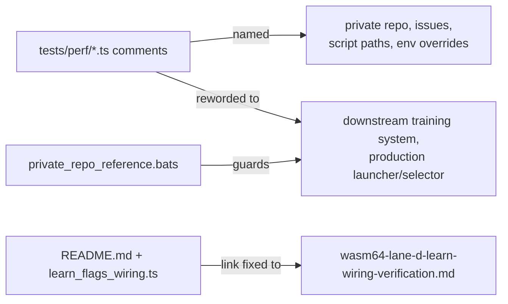

# Reword private-repo references in `tests/perf/` comments to concept level

## Summary

The four acceptance-model sources under `tests/perf/` named the private
downstream training repository directly in comments — 26 mentions across the
repo name, its private issue slugs, its internal script paths
(`worker/learn.sh`, `worker/shared/memory_calc.sh`,
`test/worker/MemoryCalcHeapSize.ts`), its prefixed environment overrides and a
private host name. NEAT-AI-core is public, so those references directed
readers at material they cannot open and carried no information a public reader
could act on (finding `BP-36e39327d964`, check 3 of the private-repo-reference
audit).

All mentions are reworded to concept level, matching the vocabulary already
established by the README (#373) and research-doc (#374) fixes — "the downstream
training system's launch scripts", "the production learn launcher", "lock-step
with the production memory-sizing formula", and the guarded failure mode stated
directly ("a marker-less non-zero exit must never be downgraded to success",
Issue #3234). **No test logic, constants or asserted numbers changed.**

Two stale in-repo links were also repaired: the lane (d) research doc was
renamed in #374, but a merge left the old `wasm64-lane-d-grq-…` path in both
`README.md` and `learn_flags_wiring.ts`, so both links were broken *and* still
carried the private repo name. The README guard for this was already failing on
the branch base.

Closes #375

## Evidence

Backend/CLI-only change — comments and a bats guard, no web interface to
screenshot. Verified by tests instead.

`tests/scripts/private_repo_reference.bats` gains three "what" guards that read
the committed sources and assert the private references are absent. They fail
against the un-reworded files and pass after the rewording:

```text
# before (guards added, sources not yet reworded)
not ok 7 perf acceptance models name no private repository
not ok 8 perf acceptance models reference no private internal script paths
not ok 9 perf acceptance models link the renamed lane (d) doc, not the old name

# after
1..9
ok 1..9   (all pass, including the previously-failing README link guard #6)
```

The unchanged behaviour of the acceptance models is confirmed by their own Deno
suites:

```text
deno test --allow-env tests/perf/learn_flags_wiring_test.ts \
                      tests/perf/learn_oome_repro_test.ts
ok | 26 passed | 0 failed (295ms)
```

`./quality.sh` passes end to end (shellcheck, bats, `deno check`, codespell,
`cargo deny`, clippy, `cargo test --workspace`, docs, release build).



## Test Plan

- **Added** `tests/scripts/private_repo_reference.bats`:
  - `perf acceptance models name no private repository` — no private repo token
    in any form (bare name, issue slug, prefixed env override) across the four
    sources.
  - `perf acceptance models reference no private internal script paths` — no
    `worker/learn.sh`, `worker/node.sh`, `memory_calc.sh`,
    `stage_fail_marker.sh` or `MemoryCalc*.ts`.
  - `perf acceptance models link the renamed lane (d) doc, not the old name` —
    the doc reference resolves to the file that exists in the tree.
- **Existing, unchanged and still green**: the 13 wiring "what" tests in
  `tests/perf/learn_flags_wiring_test.ts` and the 13 in
  `tests/perf/learn_oome_repro_test.ts` pin every number the reworded comments
  describe, so a rewording that drifted from behaviour would show up there.
- **Pre-existing failure fixed**: `README links the renamed lane (d) doc, not
  the old name` was failing on the branch base and now passes.
