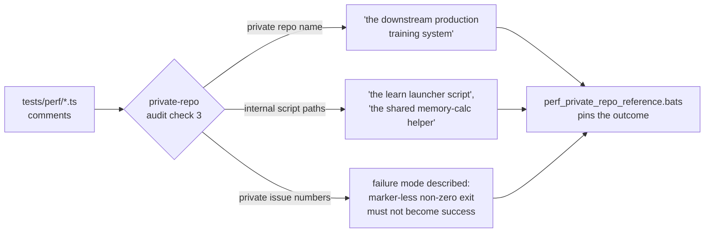

# Reword private-repo references in `tests/perf/` comments to concept level

## Summary

NEAT-AI-core is public; the four `tests/perf/` acceptance-model files named the
private downstream trainer repository — its internal scripts, its CI test files
and its private issue numbers — 26 times across their comments (finding
`BP-36e39327d964`, private-repo-reference audit check 3). The tests were already
self-contained and runnable by anyone, but their prose pointed readers at a
repository and issue numbers they cannot open, so those references carried no
information a public reader could act on.

All mentions are now reworded to **concept level**, reusing the vocabulary
already settled in the lane (d) research doc (Issue #374): "the downstream
production training system", "the learn launcher script", "the shared
memory-calc helper", "lock-step with the production memory-sizing formula". The
silent-failure guard is described by its failure mode — *a marker-less non-zero
exit must not be downgraded to success* (Issue #3234) — instead of by a private
issue number.

**No test logic, constants, or assertions changed.** The lock-step MB values
(8 GB → 4326, 16 GB → 9651, 4 GB → 1664) and every exported function are
untouched; only comments and two test *names* that embedded a private issue
number were edited.

Two adjacent fixes were needed to leave the gate green:

- Added `tests/scripts/perf_private_repo_reference.bats` — the regression guard
  for this finding (a milestone merge re-introduced the private name into the
  README once already, so pinning the outcome matters).
- Fixed the README link to the lane (d) research doc, which still pointed at the
  pre-rename filename that carried the private repo name. That doc was renamed
  by #381 without the README being updated, leaving a broken in-repo link that
  was **already failing** the existing `private_repo_reference.bats` gate on
  `Develop`.

Closes #375.

## Evidence

This is a comments-and-docs change to backend/CLI test sources — there is no web
interface to screenshot. The evidence is the guard test going red → green and
the unchanged perf suite staying green.

**Guard test fails against the un-reworded sources (5 of 6 red):**

```text
1..6
ok 1 all four perf acceptance-model files exist
not ok 2 perf sources name no private repository
not ok 3 perf sources reference no private repository path or issue slug
not ok 4 perf sources name none of the private trainer's internal scripts
not ok 5 perf sources name none of the private trainer's CI test files
not ok 6 perf sources link only research docs that exist
```

**…and passes after the rewording:**

```text
1..6
ok 1 all four perf acceptance-model files exist
ok 2 perf sources name no private repository
ok 3 perf sources reference no private repository path or issue slug
ok 4 perf sources name none of the private trainer's internal scripts
ok 5 perf sources name none of the private trainer's CI test files
ok 6 perf sources link only research docs that exist
```

**The perf acceptance models are unaffected — all 26 tests still pass:**

```text
deno test --allow-env --allow-read tests/perf/learn_flags_wiring_test.ts \
                                   tests/perf/learn_oome_repro_test.ts
ok | 26 passed | 0 failed (103ms)
```

**Full local gate:** `./quality.sh < /dev/null` → `✅ All quality checks passed!`
with **zero** `not ok` bats results (264 bats tests, previously 1 red from the
stale README link).

What the audit checks, and where each check now lands:



## Test Plan

Added — `tests/scripts/perf_private_repo_reference.bats` (6 "what" tests over
the committed artefacts, matching the style of the existing
`private_repo_reference.bats` / `readme_private_repo_reference.bats` guards):

- `all four perf acceptance-model files exist`
- `perf sources name no private repository` — word-boundary token match
- `perf sources reference no private repository path or issue slug` — catches
  `stSoftwareAU/…`, `…#NNNN` and host-name slugs
- `perf sources name none of the private trainer's internal scripts`
- `perf sources name none of the private trainer's CI test files`
- `perf sources link only research docs that exist` — every
  `docs/research/*.md` link in the perf sources must resolve in the tree (this
  is what caught the stale lane (d) filename)

Unchanged and re-run to prove no behaviour drift:

- `tests/perf/learn_flags_wiring_test.ts` — 13 tests (RAM-aware heap selection,
  floors, budget-fit, flag token, fail marker)
- `tests/perf/learn_oome_repro_test.ts` — 13 tests (crash classification, peak
  attribution, wasm32 4 GiB ceiling, marker synthesis)
- `tests/scripts/private_repo_reference.bats` — now fully green, including the
  README lane (d) link assertion that was red before this PR
