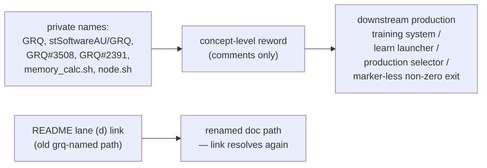

## Summary

Reworded the private-repo references in the four `tests/perf/` acceptance-model
sources to concept level. NEAT-AI-core is public; the downstream trainer sibling
is not, so comments that named it, linked its issue numbers, or pointed at its
internal script paths gave a public reader nothing they could act on (check 3 of
the private-repo-reference audit, finding `BP-36e39327d964`). **No test logic
changed** — only comments and test names. Closes #375.

Wording changes:

| Before | After |
| --- | --- |
| "The PRODUCTION selection lives in GRQ (stSoftwareAU/GRQ)" | "The PRODUCTION selection lives in the downstream production training system, which this public repository does not contain" |
| "`worker/shared/memory_calc.sh` — `get_max_heap_size` / `get_heap_floor_mb`" | "a shared memory-budget helper … (a heap-size and a heap-floor function)" |
| "`worker/learn.sh` — injects … (the BEGIN_LEARN_DENO_ARGV_2950 block)" | "the learn launcher script injects … into the `deno run` argv of the learn entry point" |
| "so node.sh cannot downgrade a marker-less OOM abort to success (GRQ#2391 / Issue #3234)" | "so the parent launcher cannot downgrade a marker-less OOM abort to success" |
| "CI-guarded in GRQ by `test/worker/MemoryCalcHeapSize.ts`" | "The production selector has its own CI gates in that downstream system" |
| "lock-step with `memory_calc.sh` … divergence … and GRQ's" | "lock-step with the production memory-sizing formula … and the production selector's" |
| "the GRQ#3508 tier" / "GRQ#3508's signature" | "the OOME tier" / "the OOME's signature" |
| "GRQ-26: 8 GB total but only 3865 MB available" | "The constrained-host case: 8 GB total but only 3865 MB available" |
| "`GRQ_MAX_HEAP_CAP_MB`" / "`GRQ_HEAP_AVAILABLE_AWARE_FLOOR`" | "the max-heap cap" / "opt-in and off for the learn path" |

The technical content is unchanged: the RAM-aware sizing formula, its constants,
the tier floors, the exact expected MB values, and the fail-loud exit-133
behaviour are all still described — the guarded failure mode now reads as "a
marker-less non-zero exit must not be downgraded to success" without the private
issue numbers.

Also repointed the README lane (d) link from
`wasm64-lane-d-grq-learn-wiring-verification.md` to the renamed
`wasm64-lane-d-learn-wiring-verification.md`. That link broke on `Develop` when
#374 renamed the file, leaving the private repo name in a public README path and
`tests/scripts/private_repo_reference.bats` red; the same stale path in
`tests/perf/learn_flags_wiring.ts` is fixed by the reword above.

## Evidence

Comment/documentation-only change to test sources — no web interface to
screenshot. Verified by a new bats regression gate plus the unchanged Deno test
suites, which still pass against the untouched logic.

Verification output:

- `bats tests/scripts/perf_private_repo_reference.bats` — 5/5 pass (all 4
  content assertions failed before the reword).
- `deno test --allow-env tests/perf/learn_flags_wiring_test.ts tests/perf/learn_oome_repro_test.ts`
  — 26 passed, 0 failed (identical to before the change).
- `./quality.sh` — `✅ All quality checks passed!` (exit 0), including the
  previously-red `private_repo_reference.bats` README link test.
- `grep -rnE '\bGRQ\b' tests/perf/` — no matches.

## Test Plan

Added `tests/scripts/perf_private_repo_reference.bats` (Issue #375, TDD —
written failing first, then made green by the reword). It reads the published
source artefacts and asserts observable outcomes:

- the four `tests/perf/` acceptance-model sources exist;
- none names the private repository (`GRQ` token, word-boundary matched);
- none links a private issue slug (`stSoftwareAU/GRQ` / `GRQ#NNNN`);
- none names the private trainer's internal scripts (`worker/learn.sh`,
  `memory_calc.sh`, `node.sh`, `stage_fail_marker.sh`, `MemoryCalc*.ts`);
- every `docs/research/…md` path referenced by the wiring model resolves in-tree
  (pins the renamed lane (d) doc pointer against rot).

No existing tests were removed or modified other than two comment lines and one
test name inside `learn_flags_wiring_test.ts`; every assertion and expected value
is unchanged. No Rust sources changed, so the workspace build/test surface is
unaffected.
