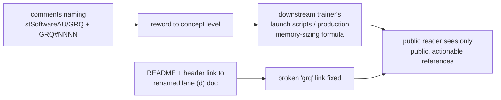

## Summary

Reworded the private `stSoftwareAU/GRQ` repository references in the
`tests/perf/` acceptance-model comments to **concept level**, so a public reader
of NEAT-AI-core is no longer pointed at a private repo, private file paths,
private env-var names, or private issue slugs they cannot see. No test logic
changed — the reword touches comments and test-name strings only, and all
existing tests still pass unchanged. Closes #375.

The comments now describe the same behaviour generically: "the downstream
trainer's launch scripts", "lock-step with the production memory-sizing
formula", and the guarded failure mode as "a marker-less non-zero exit must not
be downgraded to success" (retaining the public `Issue #3234` fail-loud
reference), dropping the `GRQ`, `stSoftwareAU/GRQ`, `GRQ#3508`, `GRQ#2391`,
`GRQ-26`, `GRQ node.sh`, `GRQ MemoryCalcHeapSize.ts`, and `GRQ_*` env-var
mentions.

While greening the quality gate I also fixed a **pre-existing** broken link: the
lane (d) research doc was renamed by PR #374
(`wasm64-lane-d-grq-...` → `wasm64-lane-d-...`), but `README.md` line 52 and the
`learn_flags_wiring.ts` header comment still pointed at the old `grq` filename.
Both now link the renamed doc — this cleared the `private_repo_reference.bats`
gate test "README links the renamed lane (d) doc, not the old name".

### Files changed

- `tests/perf/learn_flags_wiring.ts` — 14 GRQ mentions reworded; stale doc link fixed.
- `tests/perf/learn_flags_wiring_test.ts` — 9 GRQ mentions reworded (header, section banners, one test-name string).
- `tests/perf/learn_oome_repro.ts` — 5 GRQ mentions reworded.
- `tests/perf/learn_oome_repro_test.ts` — 1 GRQ mention reworded.
- `README.md` — pre-existing broken lane (d) doc link corrected to the renamed file.

## Evidence

Backend/comment-only change — no web interface to screenshot. Verified by:

- `grep -rin "grq\|stsoftware" tests/perf/` → **no matches** after the reword.
- `deno test --allow-env tests/perf/learn_flags_wiring_test.ts tests/perf/learn_oome_repro_test.ts` → **26 passed | 0 failed** (behaviour unchanged).
- `./quality.sh` → **258 ok, 0 failures** (was 1 failing before the README link fix).

## Test Plan

No new tests: this is a comment/string reword with zero behaviour change, and
`AGENTS.md` forbids source-grep "how" tests — a test asserting on comment text
would be exactly the kind this repo discourages. Coverage is instead confirmed
by:

- The existing `tests/perf/learn_flags_wiring_test.ts` and
  `tests/perf/learn_oome_repro_test.ts` (26 cases) still pass, proving the reword
  left behaviour untouched.
- The `private_repo_reference.bats` gate (including the renamed-doc-link check)
  passes, proving no private-repo slug remains in the reworded surface.
