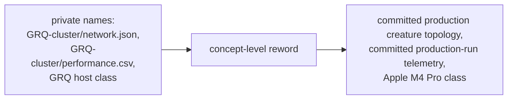

# Reword GRQ-cluster provenance mentions in benches to concept level

## Summary

NEAT-AI-core is a **public** repository, but the benchmark suite's docs and
comments repeatedly named the **private** `stSoftwareAU/GRQ-cluster` repository
(and the `GRQ` host class) as the provenance of the synthetic bench fixtures —
e.g. `GRQ-cluster/network.json`, `GRQ-cluster/performance.csv`, "GRQ host
class". The fixtures are synthesised in code (no private data is committed), so
those private paths added nothing a public reader could use while exposing the
layout of a private production repo (check 3 of the private-repo-reference
audit).

This change rewords the enumerated textual mentions to **concept level** with
**no bench logic or number changes**:

- The fixture is now described as *"the committed production creature topology
  (1,666 non-input neurons, 21,513 synapses, 2,461 inputs)"*.
- The record-count calibration is now *"derived from committed production-run
  telemetry (a 32-generation production run)"* rather than named private CSV/JSON
  paths.
- The host class is stated as the concrete hardware — *"Apple M4 Pro class"* —
  instead of *"GRQ host class"*.
- The cross-repo wiring note (`BASELINE.md`) is de-named to *"a WorkerPool
  idle-tail change and a host-flags change in the downstream production repos"*.

Files touched: `neat-core/benches/BASELINE.md`,
`neat-core/benches/common/mod.rs`, `neat-core/benches/README.md`,
`neat-core/tests/bench_fixtures.rs`.

Closes #376.

## Scope note

The issue enumerated the `GRQ`/`GRQ-cluster` mentions in the four bench files;
those are all reworded. The lowercase test-function name
`production_exact_matches_committed_grq_topology` was **not** in the enumerated
list and is referenced by an archived, point-in-time PR summary
(`docs/archive/pr-summaries/pr-summary-286.md`); it is left unchanged to stay
within scope and avoid a dangling reference in that historical record. Other
`GRQ` mentions in archived PR summaries are historical records for other issues
and are out of scope here.

## Evidence

Backend/docs-only change — no web interface to screenshot. Verification is by
grep plus the existing bench-fixture test suite and a bench compile:

- No enumerated `GRQ` mention remains in the four bench files:
  `grep -rn "GRQ" neat-core/benches/ neat-core/tests/bench_fixtures.rs` → no
  matches.
- Bench fixture tests still pass (comments only changed):
  `cargo test -p neat-core --test bench_fixtures` → **15 passed; 0 failed**.
- Benches still compile (they include `benches/common/mod.rs`):
  `cargo bench -p neat-core --no-run --features parallel` → **Finished**.

## Test Plan

- Ran `cargo test -p neat-core --test bench_fixtures` — all 15 tests pass,
  confirming the reworded comments did not alter fixture behaviour.
- Ran `cargo bench -p neat-core --no-run --features parallel` — benches compile,
  confirming the `common/mod.rs` doc-comment edits are valid.
- Ran `./quality.sh` — the only failures (`perf sources name none of the private
  trainer's internal scripts`, `perf acceptance models reference no private
  internal script paths`) are **pre-existing on the base branch**, concern
  `tests/perf` (unrelated to benches), and are not introduced by this change.
