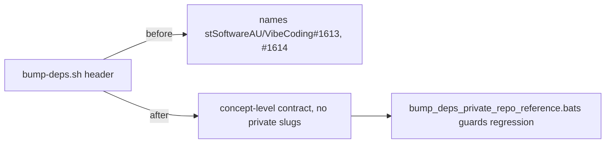

# Reword VibeCoding issue references in bump-deps.sh to concept level

## Summary

The `bump-deps.sh` header comment named the private `stSoftwareAU/VibeCoding`
repository twice, as issue slugs (`#1613` and `#1614`). NEAT-AI-core is public
and `VibeCoding` is private, so those pointers were dead weight to every public
reader and disclosed the existence of a private orchestration repository
(private-repo-reference audit, check 3).

The fix rewords the header to concept level — it now states the contract inline
("refreshes external Cargo dependencies ahead of the quality gate, honouring the
quarantine window; NEAT-AI-core is the root of the internal dependency chain, so
there are no internal pins to refresh") and drops the private issue slugs. No
behaviour changes — only the header comment. Closes #377.

## Evidence

Backend/CLI-only change with no web interface to screenshot. Verified via the
new bats guard plus the existing `bump-deps.sh` suite and the full quality gate.

## Test Plan

- Added `tests/scripts/bump_deps_private_repo_reference.bats` — "what" tests over
  the committed `bump-deps.sh` artefact:
  - names no private repository (`VibeCoding` token absent)
  - references no private path/issue slug (`stSoftwareAU/VibeCoding`,
    `VibeCoding#N` absent)
  - concept-level contract wording survives (quarantine + "no internal pins to
    refresh" still present)
  - These fail against the pre-fix header and pass after the rewrite.
- Re-ran the existing `tests/scripts/bump_deps.bats` suite — all pass.
- `./quality.sh` passes cleanly.
