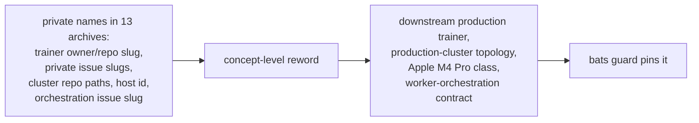

# Reword private-repo mentions in archived PR summaries to concept level

## Summary

NEAT-AI-core is a **public** repository, but thirteen archived PR summaries
under `docs/archive/pr-summaries/` named the **private** production-trainer and
worker-orchestration repositories by name or slug — the production trainer's
`owner/repo` slug, four of its private issue references, two private
orchestration issue slugs, the private cluster repository's committed
`network.json` and `performance.csv` paths, one of its host identifiers, and a
private launcher's own shell function. A public reader following those pointers
hits material they cannot open and learns the layout of a private production
system — check 3 of the private-repo-reference audit.

This change rewords the enumerated mentions to **concept level**, keeping the
historical narrative intact:

| Before | After |
| --- | --- |
| "… workflow sync", naming the private orchestration repository | "the worker-orchestration workflow sync" |
| "per the contract in" / "no internal pins per", each citing a private orchestration issue slug | "per the worker-orchestration contract" / "no internal pins to refresh under that contract" |
| "one … training shard's worth …", naming the private cluster repository and its committed `performance.csv` / `result.json` | "one production-cluster training shard's worth … committed production-run telemetry" |
| "Apple Silicon", qualified by a private host identifier and its host class | "Apple Silicon (Apple M4 Pro class)" |
| "the production … scoring hot path" / "Real … creatures", both naming the private trainer | "the downstream production scoring hot path" / "Real production creatures" |
| "the committed `network.json` shape" / "the exact committed … topology", both naming the private cluster repository | "the downstream production cluster's committed creature shape" / "the exact committed production-cluster topology" |
| a private trainer issue slug, "(flags)" | "a downstream production-trainer issue (flags)" |
| "…'s captured signature" / "= …", both a private OOME issue slug | "the downstream production trainer's captured OOME signature" / "= the production OOME" |
| "Silent-failure guard", citing a private issue slug | "Silent-failure guard (the fail-loud rule, Issue #3234)" |
| "Verified against" the private trainer's `owner/repo` slug and its `Develop` | "Verified against the downstream production trainer's `Develop` branch" |
| the private trainer's name possessive of "`worker/learn.sh`" / "production selector" / "real `memory_calc.sh`" | "the production trainer's `worker/learn.sh`" / "the production selector" / "the production trainer's real `memory_calc.sh`" |
| a private host identifier's "crash class" | "the constrained-host crash class" |
| the private launcher's own fail-loud shell function, "EXIT trap" | "fail-loud EXIT trap" |

Files touched (13 archives): `pr-summary-5.md`, `pr-summary-6.md`,
`pr-summary-38.md`, `pr-summary-228.md`, `pr-summary-243.md`,
`pr-summary-246.md`, `pr-summary-261.md`, `pr-summary-286.md`,
`pr-summary-287.md`, `pr-summary-288.md`, `pr-summary-296.md`,
`pr-summary-298.md`, `pr-summary-299.md`.

Closes #378.

## Scope note

Two deliberate exclusions:

- `production_exact_matches_committed_grq_topology` in `pr-summary-286.md` is
  **this** repository's own live test-function name. Renaming it in an archive
  would dangle against the test suite, so it stays — the same call
  `pr-summary-376.md` made. The guard matches on **word boundaries**, so
  snake_case identifiers that merely embed the letters are not flagged.
- `pr-summary-373.md` … `pr-summary-377.md` are the records of the earlier
  reword PRs; at the time their before/after tables quoted the old strings to
  stay meaningful, and they were not in this issue's enumerated list. Issue #664
  later closed that exclusion — those records now state their "before" side at
  concept level too, and all of them are covered by this guard.

The new guard's `grep` patterns necessarily spell the private tokens — a guard
cannot match a name it does not spell. The before/after table above no longer
does: since Issue #664 it describes each removed name rather than reproducing
it, which keeps the record of a reword readable without republishing the private
name.

Internal script paths (`worker/learn.sh`, `memory_calc.sh`, `node.sh`) are left
as-is: the issue scoped this sweep to repository names and issue slugs, and
`tests/scripts/private_repo_reference.bats` already governs those paths where
they appear in live sources.

## Evidence

Docs-only change — no code, no web interface to screenshot. Verification is the
new bats guard plus the existing gates.

- `bats tests/scripts` → **289 tests, 0 failures** (9 of them new).
- `deno run --allow-read scripts/check_mermaid.ts .` → all Mermaid blocks pass
  (two diagrams were reworded).
- `./quality.sh < /dev/null` → passes cleanly.

## Test Plan

New guard `tests/scripts/archive_pr_summaries_private_repo_reference.bats`
(9 "what" tests over the committed artefacts, matching the style of the existing
`private_repo_reference.bats` / `bump_deps_private_repo_reference.bats`). It
fails against the pre-fix tree — the three private-name assertions all matched
before the reword — and passes after:

- `every enumerated archived PR summary is present` — the guard cannot silently
  pass by pointing at missing files.
- `archived PR summaries name no private production-trainer repository` —
  the trainer repository's name, word-boundary matched, absent across all
  thirteen.
- `archived PR summaries name no private worker-orchestration repository` —
  the orchestration repository's name, word-boundary matched, absent.
- `archived PR summaries reference no private repository path or issue slug` —
  both `owner/repo` paths and every `repo#N` / `repo #N` issue slug spelling
  absent.
- The private-launcher-identifier test over `pr-summary-299` — the one
  snake_case case the word-boundary rule cannot reach.
- Four narrative-survival assertions so the reword cannot degrade into deletion:
  the bump contract (`pr-summary-38`), the learn-invocation wiring
  (`pr-summary-299`), the exit-133 heap signature (`pr-summary-296`), and the
  production topology numbers (`pr-summary-286`).
