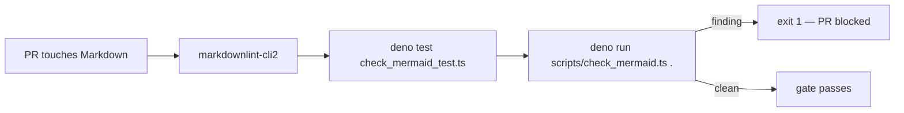
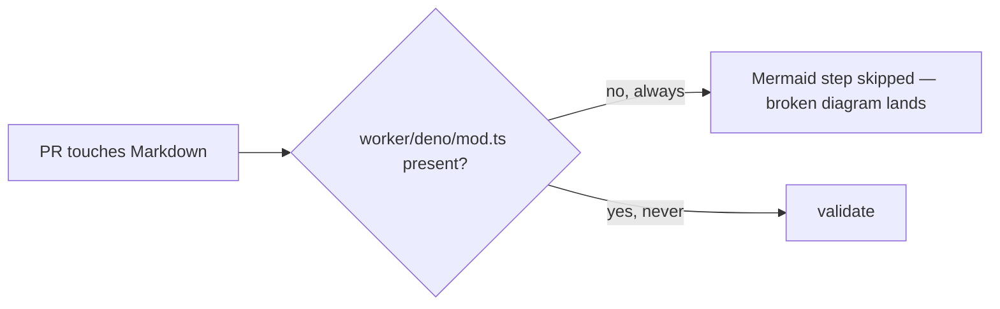

## Summary

Fixes the Mermaid parse error carried over on the baseline tracker and closes
the gap that let it land: `docs/archive/pr-summaries/pr-summary-334.md` had an
unescaped `;` in a `sequenceDiagram` note (Mermaid reads it as a statement
separator and truncates the message), while this repo's CI Mermaid step
self-skipped because it was conditional on `worker/deno/mod.ts` — a module that
never exists here. The `;` is now an em dash, and the Mermaid gate is
unconditional and **owned by this repository** (`scripts/check_mermaid.ts`), with
no cross-repo coupling. Closes #379.

Changes:

- `docs/archive/pr-summaries/pr-summary-334.md:47` — `1 concurrent run; publishers…`
  → `1 concurrent run — publishers…`.
- `scripts/check_mermaid.ts` (new) — repo-owned Mermaid gate: unescaped `;` in
  `sequenceDiagram` message text, empty blocks, unknown diagram types, and
  unterminated fences all fail loud with a `file:line (type): message`
  diagnostic and a non-zero exit.
- `.github/workflows/markdown-lint.yml` — removed the `worker/deno/mod.ts`
  probe and both `if:` guards; Deno install, the gate's unit tests, and the gate
  itself now run on every PR.
- `quality.sh` — runs the same gate locally, so CI and local agree.

A full-tree scan after the fix reports zero Mermaid findings across all 97
Mermaid-bearing documents, matching the scan evidence in the issue.

### Gate flow



Before, the validation step was skipped entirely:



## Evidence

Backend/CLI change — no web interface to screenshot. The evidence is the gate
reproducing the tracker's finding verbatim before the fix:

```text
[mermaid] docs/archive/pr-summaries/pr-summary-334.md:47 (sequenceDiagram): Line 12:
message text contains unescaped ';' which Mermaid parses as a statement separator.
Replace ';' with ',' or ' — ' (or remove it).
Offending line: Note over GA: 1 concurrent run; publishers keep every run
```

That is byte-for-byte the finding recorded on the tracker, produced by
`checkTree` against the committed tree. After the one-character fix the same
scan returns no findings and the gate exits 0.

## Test Plan

New — `tests/check_mermaid_test.ts` (14 Deno tests, all calling the real
validator with real Markdown):

- `checkMarkdown flags an unescaped ';' in sequenceDiagram message text` —
  regression test for this issue; fails against the unfixed line.
- `checkMarkdown accepts the same sequenceDiagram note once the ';' is replaced`.
- `checkTree scans committed Markdown and finds no Mermaid errors` — whole-tree
  guard; this is the test that failed before the fix.
- `checkTree surfaces a broken diagram written into the tree` — proves the scan
  is not silently passing.
- Escaping/false-positive guards: HTML entities (`&lt;`) are not separators; `;`
  inside non-sequence diagram labels is left alone; every diagram type used in
  this repo is accepted.
- Structural failures: empty block, unknown diagram type, unterminated fence,
  and nested ```` ```mermaid ```` samples inside a wider fence being out of scope.
- `formatFinding` renders the `file:line (type): Line N:` diagnostic.

New — `tests/scripts/markdown_lint_workflow.bats`:

- `markdown-lint workflow validates Mermaid unconditionally with the repo-owned gate`
- `markdown-lint workflow runs the Mermaid gate unit tests`
- `repo-owned Mermaid gate rejects a broken diagram and passes the tree`

**Documented business-logic change:** the existing bats test
`markdown-lint workflow gates Mermaid validation on a Deno worker module`
asserted the self-skipping behaviour this issue removes, so it was replaced (not
deleted) by the unconditional assertion above; the rationale is recorded in a
comment beside it. No other test was removed or commented out.

Commands run: `deno test --allow-read --allow-write tests/check_mermaid_test.ts`
(14 passed), `bats tests/scripts/markdown_lint_workflow.bats` (14 passed),
`./scripts/typescript-check.sh`, `actionlint`, `codespell`, and `./quality.sh`.

Pre-existing, unrelated: `tests/scripts/perf_private_repo_reference.bats` fails
two cases (`perf sources name none of the private trainer's internal scripts`,
`perf acceptance models reference no private internal script paths`) on the
unmodified base commit as well — out of scope here, they belong to the
concept-level rewording work (#375/#376).

## Security self-check

- No new external input surface: the gate reads committed Markdown only, runs
  with `--allow-read` (unit tests add `--allow-write` for a temp dir), and takes
  no network or env permission.
- No secrets staged; the only hidden path touched is `.github/workflows/`.
- No new third-party dependency; the action SHA pin reuses the
  `denoland/setup-deno@v2.0.5` SHA already used by `ci.yml`.
