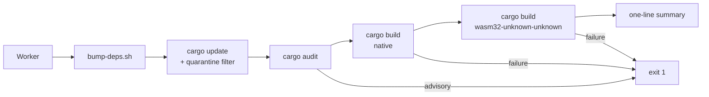

## Summary

Adds `bump-deps.sh` at the repo root, invoked by the Vibe Coder worker before
`quality.sh` per the contract in stSoftwareAU/VibeCoding#1613. NEAT-AI-core is
the root of the stSoftware dependency chain (no internal pins per
stSoftwareAU/VibeCoding#1614), so the script focuses on the external
(crates.io) bump, the audit gate, and dual native/WASM build verification.

The script:

1. Runs `cargo update`, honouring `VIBE_BUMP_QUARANTINE_HOURS` (default 24h)
   so versions published less than N hours ago are deferred to dodge
   fast-flagged supply-chain attacks.
2. Runs `cargo audit` and fails non-zero with the offending crate +
   advisory ID surfaced on the summary line.
3. Runs `cargo build --workspace` (native) **and**
   `cargo build --workspace --target wasm32-unknown-unknown` — both must pass.
4. Prints a one-line summary of what was bumped (or `no bumps`).

Exit 0 = clean / no-op. Non-zero = bump rejected by audit/build; the worker
reverts per the contract.

`quality.sh` now also runs `bats tests/scripts` so the shell helper has
coverage in the local gate (matching the NEAT-AI-scorer pattern).

Closes #38.

## Evidence

Backend / CLI change — no UI to screenshot. Verified by:

- 12 new `bats` tests in `tests/scripts/bump_deps.bats` (all pass).
- A live invocation against the bumped tree:
  ```
  ./bump-deps.sh --skip-external
  audit: ok
  build: ok (native + wasm)
  bump-deps: no bumps (external=skipped; audit=ok; build=ok (native + wasm))
  ```
- A clean `./quality.sh` run (fmt, clippy `-D warnings`, workspace tests,
  `cargo deny`, `cargo doc -D warnings`, release build, bats).



## Test Plan

`tests/scripts/bump_deps.bats` (12 tests) — exercises the script end-to-end
with temporary fixtures rather than greps:

- `shows usage with --help` — `--help` exits 0 and lists `--quarantine-hours`.
- `rejects unknown options` — typo returns non-zero with `unknown option`.
- `rejects non-integer quarantine hours` — guards the env-var input parse.
- `all skip flags: produces a clean no-op` — `--skip-*` short-circuits all
  stages and the summary reports `no bumps`.
- `summary line is single-line and lists every stage` — final line carries
  `external=`, `audit=`, `build=` fields.
- `summary includes WASM build stage label` — the build= field appears even
  when builds are skipped.
- `check-published: ancient timestamp is older than quarantine (exit 0)` —
  `--check-published` helper is the quarantine primitive.
- `check-published: very recent timestamp is within quarantine (exit 1)` —
  fresh timestamps are deferred.
- `check-published: quarantine of zero hours always allows the bump` — edge
  case for callers wanting to opt out.
- `check-published: invalid timestamp surfaces an error` — parse failure is
  distinct from "still fresh".
- `VIBE_BUMP_QUARANTINE_HOURS env var is honoured for quarantine default` —
  env var feeds the default.
- `rejects --skip-internal (NEAT-AI-core has no internal deps)` — locks in
  the design decision that there is no internal step (root of the chain).

All existing tests continue to pass; `./quality.sh` passes cleanly.
