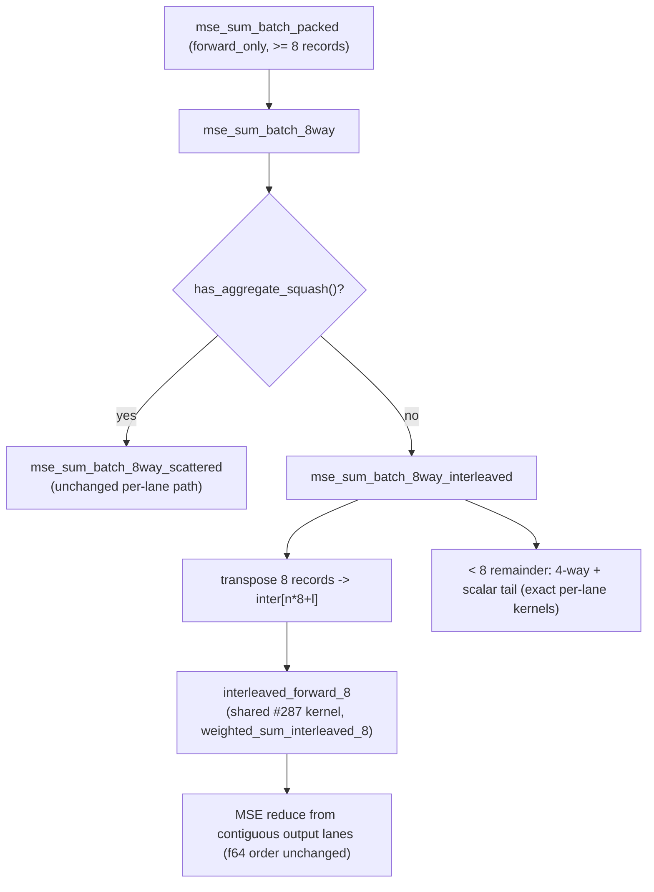

# Route the fused MSE batch loss path through the #287 interleaved gather

## Summary

The `#[wasm_bindgen]` fused activate + MSE entry point (`mse_sum_batch_packed`)
— the loss lane production scoring actually calls — ran its **own** duplicate
forward pass over the old eight-scattered-buffer per-lane layout
(`mse_sum_batch_8way` → `weighted_sum_simd_8records`), so the record-interleaved
gather landed by #287 for `score_records` never reached it. Every neuron's
gather in the MSE lane touched 8 distinct pages per synapse.

This PR routes the standard-squash MSE path through the **same** #287
interleaved gather, so each synapse's eight lanes are one cache line instead of
eight scattered loads. `mse_sum_batch_8way` now dispatches on
`has_aggregate_squash()`:

- **Standard-only networks** (the all-`Tanh` production topology) → new
  `mse_sum_batch_8way_interleaved`, which transposes each 8-record group into an
  `inter[n*8+l]` buffer and drives the shared `interleaved_forward_8` kernel
  (factored out of `score_batch_interleaved`), then the MSE reduction reads the
  eight contiguous output lanes. The `< 8` remainder (4-record group + scalar
  tail) stays on the exact per-lane kernels.
- **Aggregate networks** (Minimum/Maximum/If/Hypotenuse/HypotenuseV2/Mean) →
  `mse_sum_batch_8way_scattered`, the previous body kept **byte-for-byte
  unchanged** (verified), so they stay on their exact per-lane path.

The `f64` MSE accumulation order and the `forward_only` `reset_state()`
semantics are untouched. The result is **bit-identical before/after** on every
network: the interleaved gather is proven bit-identical to
`weighted_sum_simd_8records`, and the aggregate path is the same code.

`Closes #384.`

## Evidence

Backend/SIMD change — no web interface to screenshot. Evidence is the parity
test suite plus the Criterion before/after A/B.

### Dispatch and numerics

### Benchmark A/B — demonstrated gain

`batched_scoring/mse_sum_8records` plus the new production-sized
`batched_scoring/mse_sum_production` (`PRODUCTION_SCORING_RECORDS = 4096` per
iteration, added so the steady-state gather cost dominates instead of per-call
setup). Same prebuilt bench binary, `--save-baseline`/`--baseline` A/B;
old = scattered `mse_sum_batch_8way`, new = interleaved reroute.

Host: **Apple M4** (10 cores), rustc 1.97.1, `--release`, Criterion
`--sample-size 10 --measurement-time 6 --warm-up-time 1`.

| benchmark (median) | old | new | change |
| --- | --- | --- | --- |
| `mse_sum_8records/production` | 175.0 µs | 76.2 µs | **−56.6%** |
| `mse_sum_production/production` (4096) | 87.96 ms | 34.97 ms | **−60.2% (≈2.5×)** |
| `mse_sum_8records/production_2x` | 384.8 µs | 167.6 µs | **−56.8%** |
| `mse_sum_production/production_2x` (4096) | 191.0 ms | 77.87 ms | **−59.2% (≈2.5×)** |
| `mse_sum_8records/production_exact` | 205.7 µs | 76.2 µs | **−63.0%** |
| `mse_sum_production/production_exact` (4096) | 103.3 ms | 34.87 ms | **−66.5% (≈3.0×)** |

All deltas `p = 0.00 < 0.05`, far outside Criterion's ±5% noise band. Per the
`BASELINE.md` squash-homogeneity caveat, these all-`Tanh` figures are a **lower
bound** — varied-squash creatures also gain the scalar-`libm`→vectorised
`Gelu`/`Mish` conversion. Recorded in
`neat-core/benches/BASELINE.md` (new "Fused MSE batch loss" section).

## Test Plan

TDD parity guards (bit-identical is the merge-blocking property):

- **`neat-core/tests/simd_weighted_sums.rs::interleaved_8_is_bit_identical_to_scattered_8records`**
  — new. Proves the foundation: `weighted_sum_interleaved_8` is bitwise
  (`f32::to_bits`) equal to `weighted_sum_simd_8records` across synapse counts
  0..=40 and three biases.
- **`loss::interleaved_mse_parity::interleaved_mse_bit_identical_to_scattered_across_boundaries`**
  — new unit test. Asserts `mse_sum_batch_8way_interleaved` is bitwise
  (`f64::to_bits`) equal to `mse_sum_batch_8way_scattered` for 7 squash types
  across record counts 8, 9, 12, 13, 15, 16, 17, 24, **4096** (full group,
  group+scalar-tail, group+4-way-remainder, production steady state).
- **`loss::interleaved_mse_parity::aggregate_dispatch_stays_on_scattered_path`**
  — new unit test. Asserts aggregate networks dispatch bit-identically to the
  scattered path (multiples of 8).
- **`neat-core/tests/mse_batch_interleaved_parity.rs`** — new integration test
  over the public `mse_sum_batch_packed` entry, standard + aggregate squashes,
  record counts 0, 1, 7, 8, 9, 12, 4096 vs the scalar single-record reference
  within tolerance (guards dispatch + lane indexing end-to-end).
- Existing `tests/mse_squash_simd_parity.rs`, `tests/interleaved_scoring_parity.rs`
  and the full `cargo test -p neat-core` suite stay green (the interleaved
  `score_batch_interleaved` refactor is behaviour-preserving).

`cargo fmt --all --check` and `cargo clippy --workspace --all-targets` (with
`-D warnings`) are clean.

### Scope notes

- `mse_sum_batch_4way` (only reached for 4–7 total records, never the production
  steady state) is left unchanged — there is no interleaved-4 kernel and it is
  outside the measured hot path.
- **Pre-existing, out of scope:** the scattered path's `< 8` aggregate remainder
  handling has a latent `unreachable!()` for Hypotenuse/HypotenuseV2/Mean
  networks whose 8-way record count leaves a 4–7 remainder. This exists on the
  base branch (unchanged by this PR) and is independent of the standard-squash
  reroute; the aggregate parity tests use multiple-of-8 counts to stay clear of
  it rather than mask or "fix" adjacent code.

### `quality.sh`

The Rust gate (fmt/clippy/tests/doc) passes. Two `bats` assertions fail on the
base branch independently of this PR —
`perf_private_repo_reference.bats` / `private_repo_reference.bats` flag
pre-existing `memory_calc.sh` / `worker/learn.sh` references in the unmodified
`tests/perf/learn_flags_wiring.ts`. No files touched by this PR are involved.
