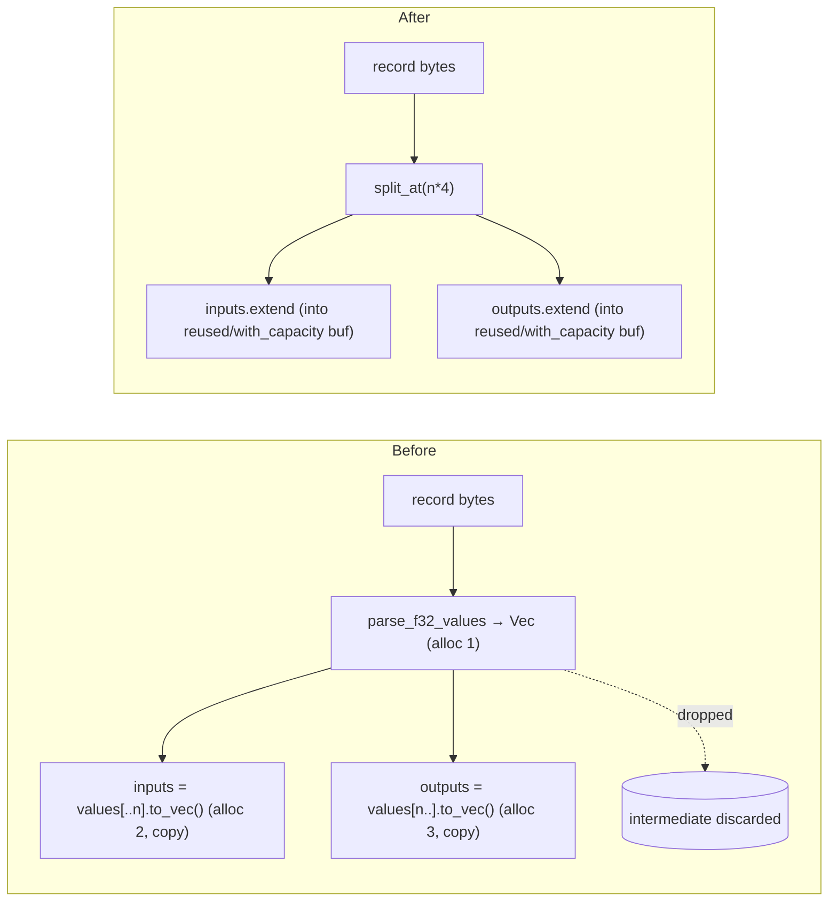

# Cut per-record allocations in the native training-data reader

## Summary

The native training-data reader (`neat-core/src/training_data.rs`) allocated
**three** `Vec`s and performed one fully-discarded copy for **every** record: it
materialised the whole record into an intermediate `Vec<f32>`, then copied both
halves out with `to_vec()` and dropped the intermediate. At production width
(2461 inputs + 1 output ≈ 9.8 KiB/record) that is ~3 heap allocations per record
plus a full second write of every byte, on all three read paths.

This PR removes the intermediate and the discarded copy:

1. **Direct parse.** `parse_record` now decodes the little-endian `f32`s
   straight into two exactly-sized `Vec`s (`Vec::with_capacity` + `extend` from
   the two input/output byte sub-slices) — 2 allocations, no discarded copy.
2. **Allocation-free streaming.** A new `parse_record_into` refills a
   caller-owned `TrainingRecord` in place (`clear()` + `extend`), reusing its
   capacity. `TrainingDataIterator::next_record_into` and
   `SeekingRecordReader::read_record_into` expose this path; `next_record` /
   `read_record` remain as thin allocating wrappers so existing callers are
   unchanged. The `clear()` leaves no stale tail when one record is reused
   across differently-shaped configs (the state-leak rule in `AGENTS.md`).
3. **Right-sized batch aggregate.** `read_dir` pre-sizes `all_records` from the
   per-file record counts it computes via `validate_file_size`, so the per-file
   `extend` no longer reallocates and memcpy's the growing vector ~log2(N) times.

`Closes #385`

## Evidence

Backend/library change — no web interface to screenshot. Evidence is an
allocation-count A/B over a synthesised **production-width** corpus (the model
named in the issue: `tests/scoring_allocations.rs`).

### Allocation A/B (production width: 2461 inputs + 1 output, 5000 records)

| Path | Allocations | Per record |
| --- | --- | --- |
| **Before** — in-memory parse (intermediate `Vec` + 2 copied-out halves) | 15,012 | **3.00** |
| **After** — `next_record_into` streaming reuse | 9 (constant) | **0.0018** |

The "after" streaming count is constant regardless of record count (buffers are
reused in place); the batch path drops from 3 allocations + 1 discarded copy to
exactly 2 allocations per record. Wall-clock over the same 5000-record corpus is
I/O-bound and essentially unchanged (~11 ms → ~11 ms); the win is the elimination
of ~1 alloc/record and the whole second copy of every byte (~21 GiB of discarded
copy traffic across the full ~2.24 M-record corpus).

The ceiling is pinned in CI by a new allocation-count harness so a revert to the
intermediate-plus-copy parse fails loudly:

- batch path (`read_file`): **≤2 allocations per record**;
- streaming path (`next_record_into`): **allocation-free per record**.

## Test Plan

New/added tests (all under `neat-core`):

- `tests/training_data_allocations.rs::reader_paths_hold_their_per_record_allocation_ceilings`
  — counting-global-allocator harness over a production-width corpus asserting
  ≤2 allocations/record on the batch path and allocation-free per record on the
  streaming path. (A single test, so the shared global counter is never read
  while a parallel test thread allocates — mirrors `scoring_allocations.rs`.)
- `training_data::tests::next_record_into_matches_next_record_across_files` —
  parity: `next_record_into` yields records byte-identical to `next_record`
  across a multi-file directory.
- `training_data::tests::next_record_into_skips_empty_files` — parity across
  empty leading/trailing files.
- `training_data::tests::next_record_into_partial_final_file` — parity when the
  final file holds a single trailing record (partial tail refill).
- `training_data::tests::reused_record_across_configs_has_no_stale_tail` —
  reusing one `TrainingRecord` from a wide config then a narrow one leaves no
  stale tail.
- `training_data::tests::seeking_read_record_into_matches_read_record` — parity
  for the seeking reader's in-place path.

Existing `training_data` tests (record contents via `read_file`, `read_dir`,
`TrainingDataIterator`, `SeekingRecordReader`, batch-vs-streaming consistency,
byte-level TS compatibility) stay green unchanged — observable record contents
did not move.

`cargo test -p neat-core` green; `cargo fmt --all --check` and
`cargo clippy --workspace --all-targets -D warnings` clean. The only `quality.sh`
failures are two pre-existing `tests/perf/*.ts` bats checks (private-script
naming, tracked by sibling milestone issues #375/#376) that are unrelated to and
untouched by this change.
