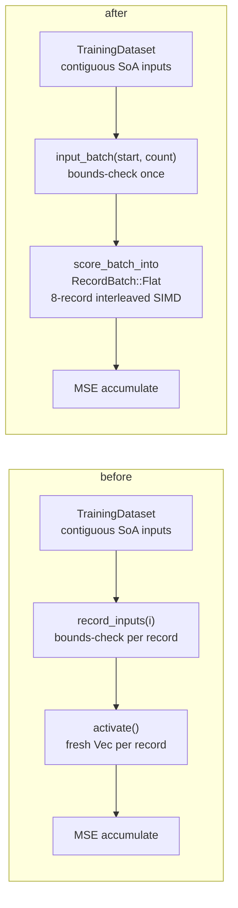

# Flat-slice record input for batched scoring, and `evaluate_mse` wired onto it (Issue #386)

## Summary

Two related gaps around record **input** layout are closed. Closes #386.

1. **The batched scorer only took `&[Vec<f32>]`.** Issue #229 flattened the
   scoring *output* to one contiguous buffer, but the input stayed a vector of
   per-record vectors — one heap allocation per record for the caller (4,096
   allocations for a ~40 MiB production shard) and a `Vec` header to
   pointer-chase on every lane load, even though the kernels only ever read a
   record as `&[f32]`. The fused-loss lane next door
   (`mse_sum_batch_packed`) already took a flat packed buffer, so the two entry
   points disagreed on layout for no reason.

   Added the matching flat **input** contract: record `i`'s inputs are
   `inputs[i * stride .. i * stride + stride]`.

   - `CompiledNetwork::score_records_flat(inputs, stride, num_outputs)`
   - `CompiledNetwork::score_records_flat_into(inputs, stride, num_outputs, out)`
   - `CompiledNetwork::score_records_parallel_flat(inputs, stride, num_outputs)`

   `score_batch_into` now takes a `RecordBatch` describing either layout, and the
   `&[Vec<f32>]` entry points are unchanged wrappers over the same kernel — so
   existing callers and benches are unaffected and both layouts are
   **bit-identical**.

2. **The WASM dataset offload path bypassed the batched kernel entirely.**
   `TrainingDataset` (Issue #298) already stores inputs contiguously in SoA
   layout and hands out zero-copy slices, yet `evaluate_mse` scored **one record
   at a time** through `activate`: re-bounds-checking per record, allocating a
   fresh `Vec<f32>` per record via `to_vec()` (exactly the per-record allocation
   #229 removed, reintroduced on the >4 GB Memory64 lane), and never touching the
   8-record interleaved SIMD path from #230/#287.

   It now bounds-checks the batch **once**, takes `input_batch(start, count)` as
   a single slice, and drives it through the flat batched path in 1024-record
   chunks — a multiple of the 8-record SIMD group, so grouping and results are
   unchanged while the scratch output buffer stays a bounded constant no matter
   how many records the Memory64 lane asks for.

Fail-loud (Issue #3234): a zero `stride` or a buffer that is not a whole number
of records **panics** with a specific message rather than silently mis-slicing
every record.

### Data flow

## Evidence

Backend/library change — no web interface to screenshot. Evidence is
benchmarks plus the TDD suites below.

### Benchmarks

Performance task, so benchmarks came **first**: the `dataset_evaluate_mse` group
was added and baselined against the unchanged implementation before any code
changed.

**Methodology.** Separate `cargo bench` invocations on this laptop drift by more
than the effect being measured on the smaller groups (a naive single-shot A/B
reported a bogus 40% "regression" on `parallel_scoring` that alternating rounds
disproved). So the A/B follows the #287 protocol: alternating old/new rounds of
the *same* prebuilt bench binaries, run back to back, with the untouched
`forward_pass` benchmark captured alongside as a drift control.

Apple M4, macOS 26.5.2, rustc 1.97.0, `--release`, Criterion 0.8
`--sample-size 10 --measurement-time 5 --warm-up-time 1`, 4096 records per
iteration (`PRODUCTION_SCORING_RECORDS`). Figures are the mean of the
alternating rounds. Recorded in
[`neat-core/benches/BASELINE.md`](../../../neat-core/benches/BASELINE.md).

`dataset_evaluate_mse` — the change under test:

| benchmark | before | after | change |
| --- | --- | --- | --- |
| `dataset_evaluate_mse/production` | 330.3 ms | 69.9 ms | **−78.8% (≈4.7×)** |
| `dataset_evaluate_mse/production_2x` | 686.7 ms | 149.7 ms | **−78.2% (≈4.6×)** |
| `dataset_evaluate_mse/production_exact` | 283.6 ms | 69.6 ms | **−75.5% (≈4.1×)** |

Drift + no-regression controls — all must be flat, and are. The `scoring` group
is the gate on the `&[Vec<f32>]` wrapper: it routes through the same rewritten
kernel and must not pay for the new input layout.

| control | before | after | change |
| --- | --- | --- | --- |
| `forward_pass/production_exact` | 48.10 µs | 49.42 µs | flat |
| `scoring/production` | 74.25 ms | 72.87 ms | flat |
| `scoring/production_2x` | 165.17 ms | 163.06 ms | flat |
| `scoring/production_exact` | 70.72 ms | 69.90 ms | flat |
| `parallel_scoring/production_exact` `1_core` | 71.5 ms | 69.4 ms | flat |
| `parallel_scoring/production_exact` `12_cores` | 41.4 ms | 43.3 ms | flat (see note) |

> The `12_cores` lane builds a fresh `ThreadPoolBuilder` per iteration and is
> scheduler-sensitive: across six alternating rounds old spanned 38.0–47.2 ms and
> new spanned 36.4–51.4 ms, so the ~5% mean gap sits well inside the run-to-run
> spread. The clean `1_core` signal is flat-to-slightly-better.

New `scoring_flat` group — same shard, same kernel, flat input layout, so the
delta against `scoring` isolates the per-record `Vec` header indirection. Both
fixtures are built outside the timed loop, so the caller-side
one-allocation-per-record the `&[Vec<f32>]` signature forces is *additional*
saving not counted here:

| benchmark | `scoring` | `scoring_flat` | change |
| --- | --- | --- | --- |
| `production` | 72.87 ms | 70.34 ms | −3.5% |
| `production_2x` | 163.06 ms | 149.70 ms | −8.2% |

## Test Plan

TDD — every suite below was written first and observed failing (the
`score_records_flat` tests failed to compile; the allocation test failed with
`delta 900`, i.e. exactly one allocation per record).

Added `neat-core/tests/flat_record_scoring_parity.rs`:

- `flat_input_matches_per_record_on_the_interleaved_arm` — bit-identity at
  record counts 0, 1, 7, 8, 9, 12 on the all-standard-squash (record-interleaved)
  dispatch arm.
- `flat_input_matches_per_record_on_the_aggregate_squash_arm` — same counts on
  the aggregate-squash per-lane fallback arm.
- `flat_input_matches_per_record_at_production_shard_width` — bit-identity at
  production input width (2,461 inputs).
- `flat_input_zero_fills_a_stride_narrower_than_the_network` — a stride shorter
  than the network's input arity zero-fills, matching the short-`Vec` behaviour.
- `flat_input_into_writes_the_same_buffer_as_the_allocating_entry_point`.
- `parallel_flat_input_matches_the_sequential_flat_path`.
- `flat_input_rejects_a_zero_stride` / `flat_input_rejects_a_ragged_buffer` —
  fail-loud panics on a malformed batch.

Added `neat-core/tests/evaluate_mse_allocations.rs` (modelled on
`tests/scoring_allocations.rs`, counting global allocator):

- `evaluate_mse_has_no_per_record_allocation` — evaluating 10× the records must
  not allocate ~10× more. Failed at `delta 900` before the fix; constant after.

Added to `neat-core/tests/wasm_dataset_offload.rs`:

- `evaluate_mse_matches_the_per_record_reference_across_group_boundaries` — the
  pre-#386 per-record implementation is retained in the test file as the
  equivalence oracle; asserted within the documented `f32` SIMD tolerance
  (2e-3) at counts 0, 1, 7, 8, 9, 12, 100.
- `evaluate_mse_matches_the_per_record_reference_on_an_offset_batch` — guards the
  start-offset arithmetic.
- `evaluate_mse_returns_zero_for_an_empty_batch` — the `count == 0` path.
- `evaluate_mse_rejects_an_empty_batch_starting_past_the_end` — a zero-count
  batch is still bounds-checked.

The existing shape-mismatch and out-of-range error-path tests, the determinism
test, and the load → evaluate → free leak gate are unchanged and still pass. No
existing test was modified or removed.

Added `dataset_evaluate_mse` and `scoring_flat` bench groups to
`neat-core/benches/hot_paths.rs`.

### Quality gate

`./quality.sh`: `cargo build`, `cargo fmt`, `cargo clippy --workspace
--all-targets --all-features -- -D warnings`, `cargo check`, `cargo test
--workspace --lib --tests --all-features` (32 test binaries, all green),
`cargo doc` with `RUSTDOCFLAGS="-D warnings"`, and `cargo build --release` all
pass. markdownlint, the Mermaid gate and shellcheck pass.

> **Pre-existing bats failures, unrelated to this change.** `perf sources name
> none of the private trainer's internal scripts` (#138) and `perf acceptance
> models reference no private internal script paths` (#151) fail identically on
> the base branch with these changes stashed — they flag private-trainer script
> names in the perf acceptance models, untouched here. They are not introduced or
> affected by this PR.

### Security self-check

- **Input validation** — the new public entry points validate `stride` (non-zero)
  and buffer length (whole number of records) before slicing, and
  `score_records_flat_into` validates the output buffer length. All fail loud.
- **Secrets** — none staged; no `.env`/`.config*.json` touched.
- **Injection surface** — none: no SQL, shell, filesystem or HTTP calls added.
- **`unsafe`** — none added. The change is pure safe Rust; the SIMD soundness
  invariants in `AGENTS.md` are untouched.
- **Error handling** — `evaluate_mse` keeps its typed `DatasetError` returns; no
  internal state leaks into messages.
- **Dependencies** — none added or changed.
