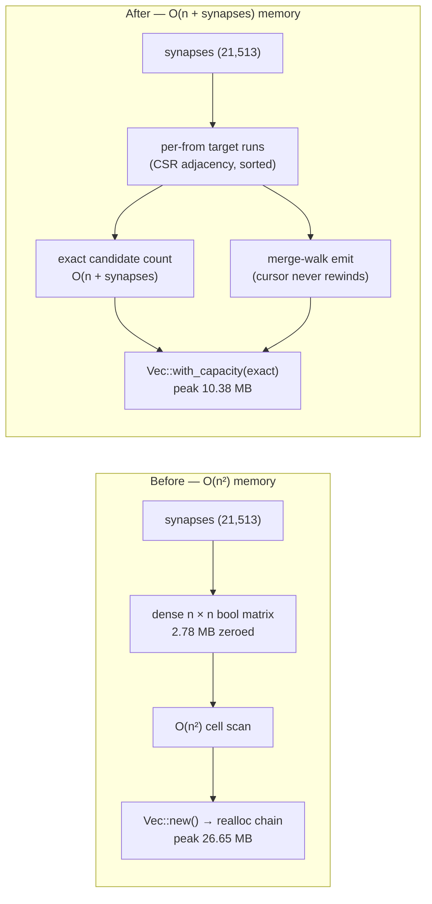

# [perf] `scan_available_connections` — drop the n² matrix, pre-size the result

## Summary

`scan_available_connections` (`neat-core/src/topology_ops.rs`) answered "does
this connection already exist?" from a **dense `n × n` boolean matrix**. On the
production topology (n = 1,666) that is a **2.78 MB zeroed allocation per call**
to record 21,513 synapses — a fill factor under 0.8%. It then built the result
with `Vec::new()` and no `reserve`, so the ~11 MB flat pair list grew through a
realloc-and-memcpy chain. This is a mutation-time helper, so both costs are paid
repeatedly across the population every generation.

Both wins from the issue are taken:

1. **The matrix is gone.** Existence is answered from a compressed per-`from`
   run of existing targets — an `O(n + synapses)` adjacency built once, then
   merge-walked against the candidate range `[start_to, n)`. Only edges the scan
   could ever emit are retained (`to > from`, `to >= num_inputs`, both endpoints
   in range), which drops backward, self and out-of-range synapses exactly as
   the old matrix lookup did. Scratch memory is `O(n + synapses)` instead of
   `O(n²)`.
2. **The result is pre-sized.** The exact candidate count is computed up front
   in `O(n + synapses)` — no `O(n²)` pre-pass — from the candidate span minus a
   constant-neuron prefix sum minus the distinct existing targets in range. The
   result vector is then `Vec::with_capacity`'d once at its final length.

**Contract is unchanged.** Same pairs, same order, same defensive bail-outs.
Sorted input is *not* required — each per-`from` run is sorted on build, so an
unsorted or duplicate-bearing edge list yields the same answer. Per the issue,
no `scan_available_connections_count()` / sampled variant was added; that is a
cross-repo API change for the caller side.

Closes #387.

## Evidence

This is a backend library change with no web interface, so there is no
screenshot. Evidence is benchmark and allocation measurement.

### A/B at the production anchor — n = 1,666 with 21,513 synapses

Same fixture, same release build, single call, measured under a tracking global
allocator. Both implementations returned the **identical 1,345,957 pairs**.

| Metric | Before (`n²` matrix) | After (#387) | Delta |
| --- | --- | --- | --- |
| Peak live bytes | 27,941,380 B (26.65 MB) | 10,887,048 B (10.38 MB) | **−61%** |
| Allocations | 22 | 5 | **−77%** |
| Wall clock | 4.55 ms | 1.66 ms | **−63%** |
| Result size | 10,767,656 B | 10,767,656 B | unchanged |

The 10.38 MB floor *is* the result vector (10.77 MB reported as live bytes
includes the exact-size allocation). Everything above it — the 2.78 MB matrix
and the realloc chain's transient second buffer — is gone.

### Criterion — new `topology_ops` group in `hot_paths`

`cargo bench -p neat-core --bench hot_paths -- topology_ops`, before and after
on the same machine:

| Case | Before (median) | After (median) | Change (Criterion) |
| --- | --- | --- | --- |
| `n1666_21513` | 6.5395 ms | 4.0470 ms | **−38.1%** (p = 0.00) |
| `n4127_21513` | 24.377 ms | 15.222 ms | **−37.6%** (p = 0.00) |

`n1666_21513` is the anchor named in the issue (1,666 neurons, 21,513
synapses); `n4127_21513` puts the same synapse count on the full
`production_exact` neuron count. Throughput is reported per candidate slot
(`n²`), so a reintroduced dense matrix or realloc chain shows up directly on the
next run.

### Where the memory went

### Failing-first verification

The differential test was validated by deliberately perturbing the new
implementation and confirming the suite goes red:

| Perturbation | Result |
| --- | --- |
| Drop the duplicate-edge guard in the counting pass | `scan_available_connections_matches_reference_on_random_topologies` **FAILED** |
| Merge-walk cursor advances on `<=` instead of `<` | 5 of 8 `scan_available*` tests **FAILED**, including the randomised differential test |

Both perturbations were reverted before commit.

## Test Plan

New tests in the `tests` module of `neat-core/src/topology_ops.rs`, all
differential against `reference_scan_available_connections` — the pre-#387
dense-matrix implementation retained verbatim as the oracle:

- `scan_available_connections_matches_reference_on_random_topologies` —
  asserts a byte-identical `Vec<u32>` (same pairs, **same order**) across 1,344
  randomised topologies: `num_neurons` ∈ {1, 2, 3, 5, 9, 16, 31} × `num_inputs`
  ∈ {0, 1, n/2, **n**} × density ∈ {**0 (empty synapse list)**, 15, 60,
  **100 (fully connected)**} × duplicate rate ∈ {0, 30} × constant rate ∈ {0,
  25, **100 (all targets constant)**} × {sorted, shuffled}. `num_inputs = 0`
  and `num_inputs = 1` cover `from < num_inputs`.
- `scan_available_connections_matches_reference_with_out_of_range_and_duplicate_edges`
  — duplicates, self-connections, backward edges and out-of-range endpoints in
  one hostile edge list.
- `scan_available_connections_matches_reference_with_short_is_constant_buffer` —
  `is_constant` shorter than `num_neurons`.
- `scan_available_connections_num_inputs_equals_num_neurons_is_empty` —
  `num_inputs == num_neurons`.
- `scan_available_connections_unsorted_edges_match_sorted_equivalent` — the
  rewrite does not depend on the caller having sorted the edge list.

New integration test `neat-core/tests/topology_ops_allocations.rs`:

- `scan_available_connections_peak_allocation_tracks_result_size` — a tracking
  global allocator asserts peak live bytes stay within `result + 1 MiB` and the
  allocation count stays ≤ 16 at n = 1,666 / 21,513 synapses. Fails against the
  old implementation (peak 26.65 MB vs an 11.8 MB budget).

Existing defensive tests unchanged and still green:

- `scan_available_connections_mismatched_lengths_returns_empty`
- `scan_available_connections_huge_neuron_count_returns_empty` — the `n * n`
  plausibility bound is retained (it is no longer an allocation size, but it
  still rejects a neuron count whose forward-pair space could never be
  materialised)
- `scan_available_simple`, `scan_skips_constant`

New Criterion group `topology_ops` in `neat-core/benches/hot_paths.rs`, with
`neat-core/benches/README.md` updated to document it.

No existing tests were commented out, removed or modified.

## Quality gate

`cargo fmt`, `cargo clippy --workspace --all-targets --all-features -D
warnings`, `cargo check`, `cargo test --workspace --lib --tests --all-features`
(all 33 test binaries green), `cargo doc -D warnings`, `cargo build --release`,
`deno check`, the Mermaid gate and codespell all pass.

**Pre-existing, unrelated gate failure.** `./quality.sh`'s bats stage is red on
a clean tree — `git stash` confirms it fails without this change. Two Issue #375
public-safety assertions (`perf sources name none of the private trainer's
internal scripts`, `perf acceptance models reference no private internal script
paths`) fire on four comments left in `tests/perf/learn_flags_wiring.ts` by
#382. CI does not run bats, so it has gone unnoticed. Out of scope of this PR;
filed as **stSoftwareAU/NEAT-AI-core#397**.

## Security self-check

- **Input validation** — the two malformed-buffer bail-outs are retained
  unchanged (mismatched `from`/`to` lengths, implausible `num_neurons`); a new
  `checked_mul` guard refuses a candidate count whose result vector could not be
  addressed, returning an empty `Vec` rather than aborting.
- **Injection surface / output encoding / auth** — not applicable; pure
  in-process computation over caller-supplied slices, no new I/O, no new
  endpoint.
- **Memory safety** — no `unsafe` added. All indexing is checked; the
  merge-walk cursor is bounded by the run end on every access, and a
  `debug_assert` pins the emitted pair count to the pre-computed capacity.
- **Secrets** — none staged; no hidden files touched.
- **Dependencies** — none added.
