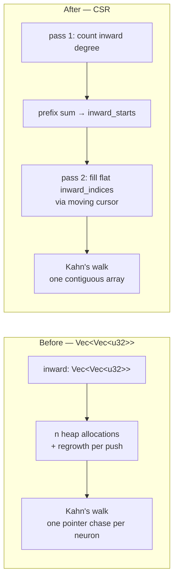

## Summary

`compute_reverse_topological_order` built its inward adjacency as a
`Vec<Vec<u32>>` — **one heap allocation per neuron** (1,666 on the production
topology) plus the geometric regrowth of every inner `Vec` as the 21,513
synapses were pushed — and Kahn's walk then chased a separate pointer per
neuron, scattering the traversal across 1,666 unrelated allocations. `queue`
and `result` were also unsized `Vec::new()`s that grew by realloc-and-copy.

This replaces the per-neuron `Vec`s with a **CSR (compressed sparse row)**
adjacency built in two passes — the same layout `PropagateInput` already uses
for its inward lists — and pre-sizes `queue` / `result` from
`n - input_count`. The function runs once per creature per generation to set up
backprop ordering, so it sits on the per-generation path.

The returned order is **unchanged, element for element**, and the defensive
skip-don't-panic behaviour on malformed input (self-loops, out-of-range
endpoints, mismatched `from`/`to` lengths, `input_count > n`, cycle tails) is
preserved exactly — this function is reached from WASM, where a trap aborts the
whole run.

Closes #388.

## Evidence

### What changed

Neuron `v`'s inward sources are `inward_indices[inward_starts[v]..inward_starts[v + 1]]`.
Pass 2 fills in synapse order, so each row lists its sources in exactly the
order the per-neuron `Vec::push` produced — which is why the emitted order is
element-identical.

### Wall-clock A/B

New Criterion group `reverse_topological_order` in `benches/hot_paths.rs`,
measured **2026-07-26** on Apple M4 Pro (12 cores, 24 GB, macOS 26.5.2 arm64),
rustc 1.97.0, Criterion 0.8.2, `--release` bench profile.
`cargo bench -p neat-core --bench hot_paths -- reverse_topological_order --save-baseline before`
then `--baseline before` after the change:

| Shape | Before (`Vec<Vec<u32>>`) | After (CSR) | Change |
| --- | --- | --- | --- |
| `small_50` | 15.60 µs | 5.88 µs | −62.3% |
| `medium_500` | 169.48 µs | 94.51 µs | −44.2% |
| `large_5000` | 2.361 ms | 1.799 ms | −23.8% |
| `production` | 588.97 µs | 231.09 µs | −60.8% |
| `production_2x` | 1.372 ms | 490.28 µs | −64.3% |
| **`production_exact`** — 1,666 non-input neurons, **21,513 synapses** | **547.19 µs** | **234.34 µs** | **−57.2%** |

Criterion reported "Performance has improved" with `p = 0.00 < 0.05` on every
shape. Full table with confidence intervals is archived in
`neat-core/benches/BASELINE.md`.

### Allocation-count A/B

Counted with a counting global allocator over a single call (the harness now
committed as `neat-core/tests/reverse_topological_allocations.rs`):

| Shape | Before | After |
| --- | --- | --- |
| n = 128, 16 inputs | 239 | 7 |
| production: n = 4,127 / 2,461 inputs / ~21.7 k synapses | **5,021** | **7** |

**717× fewer allocations** at production shape, and the count is now
independent of neuron count: `inward_starts`, `cursor`, `inward_indices`,
`out_degree`, `queue`, `result`, `visited` — seven pre-sized buffers, none of
which regrow.

### Failing-first evidence

- `reverse_topological_order_allocation_count_does_not_scale_with_neurons`
  failed against the unmodified implementation:
  `16× the neurons allocated 8174 vs 241 (delta 7933)`, and passes after.
- The differential tests were fault-injected to prove they are the catch point
  for a wrong-but-non-panicking order. Filling the CSR rows in reverse synapse
  order (a valid CSR that permutes the emitted order) left every pre-existing
  test green and failed **only** the three new differential tests:
  `…matches_reference_on_random_dags`, `…_with_cycles`,
  `…_on_malformed_edges`. An off-by-one in the prefix sum
  (`inward_starts[to] += 1`) failed 7 of the 10 tests, including the existing
  WASM-trap guards.

### CLI/backend change — no UI

Pure library change; there is no web interface to screenshot. Verified by the
Rust test suite, the Criterion A/B above and the allocation harness.

### Pre-existing, unrelated `quality.sh` failures

`./quality.sh` fails at the bats stage on two checks that are **already red on
a clean checkout of `Develop`** (verified with `git stash -u`):
`perf sources name none of the private trainer's internal scripts` and
`perf acceptance models reference no private internal script paths` — leftovers
from the Issue #375/#376 rewording of `tests/perf/*.ts`, untouched by this PR
and outside its scope. Note that CI does not run bats. Every other gate stage
was run individually and is green: `cargo fmt --all`,
`cargo clippy --workspace --all-targets --all-features -- -D warnings`,
`cargo check --workspace --all-targets --all-features`,
`cargo test --workspace --lib --tests --all-features` (all suites `0 failed`),
`RUSTDOCFLAGS="-D warnings" cargo doc --workspace --no-deps`,
`cargo build --workspace --release`, `cargo bench -p neat-core --no-run --features parallel`,
plus shellcheck, `deno check`, the Mermaid gate and codespell.

## Test Plan

Added in `neat-core/src/topology_ops.rs` (`#[cfg(test)]` module) — each pins the
CSR result against a verbatim copy of the pre-change `Vec<Vec<u32>>`
implementation kept as the differential oracle:

- `reverse_topological_order_matches_reference_on_random_dags` — 200 randomised
  DAGs (seeded PRNG, varying neuron/input counts and fan-in); asserts the order
  is element-identical to the reference and covers every non-input neuron
  exactly once.
- `reverse_topological_order_matches_reference_with_cycles` — 200 randomised
  graphs with injected back-edges; neurons left in cycles must still be
  appended at the end in ascending index order, identically to the reference.
- `reverse_topological_order_matches_reference_on_malformed_edges` — 200
  randomised graphs seeded with self-loops, out-of-range `from`, out-of-range
  `to` and duplicate edges; the CSR path must skip exactly what the reference
  skipped and must not panic.
- `reverse_topological_order_matches_reference_on_edge_case_shapes` — empty
  graph, all-inputs, no-inputs, `input_count > n`, mismatched lengths,
  self-loops only.

Added in `neat-core/tests/reverse_topological_allocations.rs`:

- `reverse_topological_order_allocation_count_does_not_scale_with_neurons` —
  counting global allocator; 16× the neurons must not raise the allocation
  count (delta < 10), and that count must stay a single-digit constant.

Unchanged and still passing (the malformed-input guards from NEAT-AI #2659):
`reverse_topological_order_oob_from_does_not_panic`,
`reverse_topological_order_oob_to_does_not_panic`,
`reverse_topological_order_mismatched_lengths_returns_empty`,
`reverse_topological_order_input_count_exceeds_neurons`,
`reverse_topological_order_simple`, `reverse_topological_order_larger`.
No existing test was modified or removed.
